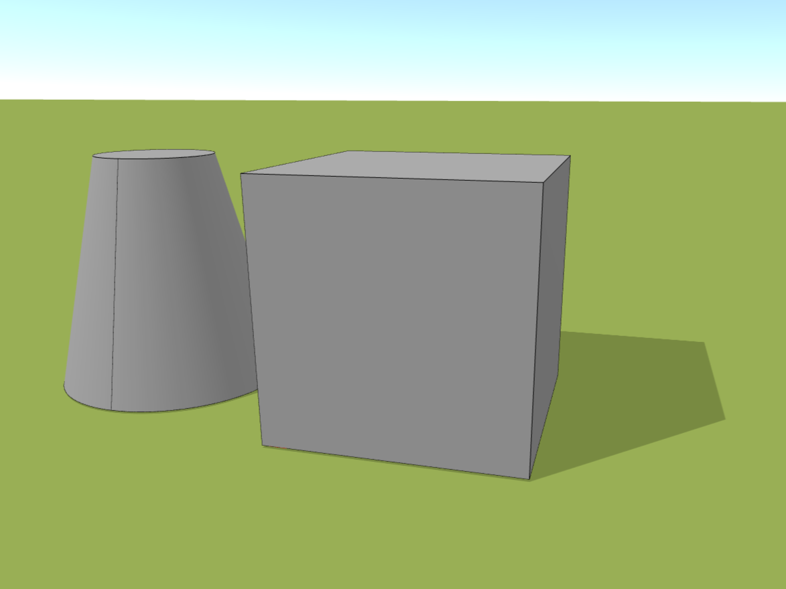
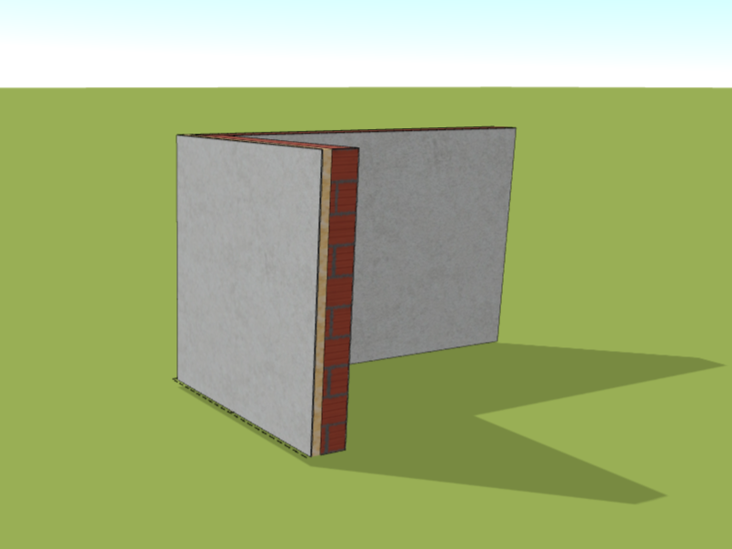

# Vložit
Zde je rychlý přehled kategorií, které vám umožní snadno vytvářet a upravovat objekty ve vašich projektech.

## Objemy

Kategorie *Objemy* vám umožňuje vytvářet různé objemy, jako jsou kvádry nebo rotační tělesa. Vložené objemy lze snadno měnit díky jednoduché editaci těchto objektů.

## Import

S tlačítkem *Import* můžete snadno přidávat objekty. Podporujeme formáty jako [DXF](../getting-started-roofs/importDxf.md) a [OBJ](../getting-started-roofs/importObj.md). Navíc můžete importovat soubory převedené z [PDF na DXF](../getting-started-roofs/convertPdfToDxf.md) nebo 3D modely z [PDF na OBJ](../getting-started-roofs/convert3dPdfToObj.md).

## Střechy

Tlačítko *Střechy* vám usnadní přidávání klíčových prvků pro modelování střech. Rychle a efektivně vytvářejte složité střešní konstrukce.

## Budovy

Tlačítko *Budovy* vám poskytuje hotové budovy, které můžete upravit dle svých potřeb. Rychle a jednoduše přidávejte budovy do svých projektů.

## Stěna

Tlačítko *Stěna* vám umožňuje snadno přidávat a upravovat stěny ve vašich modelech.

## Dekorace

Tlačítko *Dekorace* vám umožňuje zdobit vaše modely a přidávat estetické prvky. Kreativita není omezena!

## Anotace

Tlačítko *Anotace* je ideální pro přidávání čar a kót, které pomáhají zpřehlednit váš projekt.

