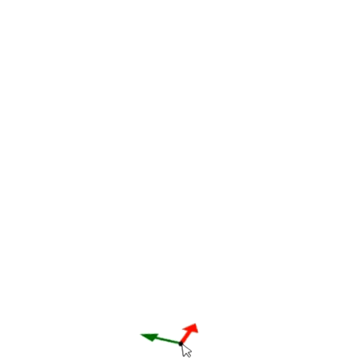

# Zadání objektu pomocí bodu

Po vybrání objektu, který chcete vložit, se na obrazovce zobrazí symbol počátku souřadného systému. Poté, pokud myší kliknete na místo, kde chcete umístit vybraný objekt, bude tento objekt vložen na zvolenou pozici.

