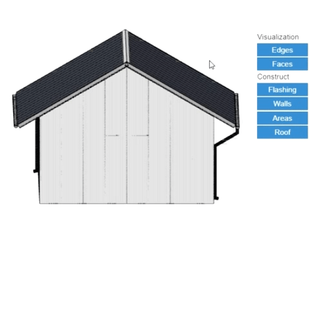

# Ovládání hladin v modelu

V modelovacím prostoru lze zapínat a vypínat jednotlivé hladiny 3D modelu. Model je rozdělen na jednotlivé objekty, které mají své hladiny. Kliknutím na tlačítko s názvem hladiny v pravé části obrazovky je možné jednotlivé hladiny vypínat a opětovně zapínat. Stejně tak je možné globálně zapnout či vypnout veškeré hrany či plochy v modelovacím prostoru pomocí tlačítek v horní části této sekce.

