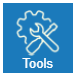
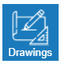

# Main
## Insert

Toto tlačítko slouží k přidání objektu do prostoru pro modelování. Můžete zde přidat různé prvky, jako jsou obecné tvary, střechy, stěny nebo dokonce celé domy. Po kliknutí se zobrazí skupiny objektů, ze kterých můžete vybírat pro vaši práci.

<!-- ### Generate

V tomto tlačítku naleznete automatické generátory, které vám usnadní práci tím, že automaticky vytvoří část vašeho modelu. -->

## Tools

 

Pod tímto tlačítkem najdete nástroje pro kontrolu vašeho modelu. Můžete je využít k měření různých rozměrů vašeho projektu a také k práci s pracovní rovinou.

## Drawings

Toto tlačítko vám umožňuje spravovat a upravovat generované výkresy prostorového modelu.

## Reports 

 

Chcete-li spravovat výstupy z vašeho modelu, použijte toto tlačítko. Nejenže zde můžete zobrazit všechny výstupy, ale většinu z nich lze také upravovat.

## Libraries

Toto tlačítko slouží k editaci všech knihoven, které jsou potřebné pro 3D modelování. Pomocí něj můžete přidávat barvy, měnit střešní krytinu a nebo třeba přidávat textury k jednotlivým materiálům.