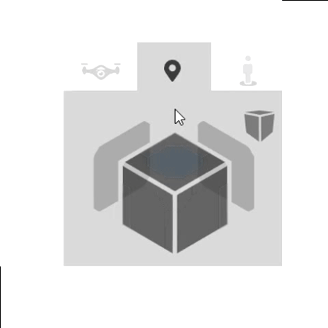

# Main

## Nabídka vlevo
### Insert

Toto tlačítko slouží k přidání objektu do prostoru pro modelování. Můžete zde přidat různé prvky, jako jsou obecné tvary, střechy, stěny nebo dokonce celé domy. Po kliknutí se zobrazí skupiny objektů, ze kterých můžete vybírat pro vaši práci.

### Tools
 

Pod tímto tlačítkem najdete nástroje pro kontrolu vašeho modelu. Můžete je využít k měření různých rozměrů vašeho projektu a také k práci s pracovní rovinou.

### Drawings

Toto tlačítko vám umožňuje spravovat a upravovat generované výkresy prostorového modelu.

### Reports 
 

Chcete-li spravovat výstupy z vašeho modelu, použijte toto tlačítko. Nejenže zde můžete zobrazit všechny výstupy, ale většinu z nich lze také upravovat.

### Libraries

Toto tlačítko slouží k editaci všech knihoven, které jsou potřebné pro 3D modelování. Pomocí něj můžete přidávat barvy, měnit střešní krytinu a nebo třeba přidávat textury k jednotlivým materiálům.

## Ovládání kamery
S touto inteligentní krychličkou můžete pohodlně přepínat mezi různými pohledy na model. Jednoduše zapínat a vypínat axonometrické zobrazení nebo měnit způsob otáčení kamery.

## Ovládání hladin v modelu

V modelovacím prostoru lze zapínat a vypínat jednotlivé hladiny 3D modelu. Model je rozdělen na jednotlivé objekty, které mají své hladiny. Kliknutím na tlačítko s názvem hladiny v pravé části obrazovky je možné jednotlivé hladiny vypínat a opětovně zapínat. Stejně tak je možné globálně zapnout či vypnout veškeré hrany či plochy v modelovacím prostoru pomocí tlačítek v horní části této sekce.

 