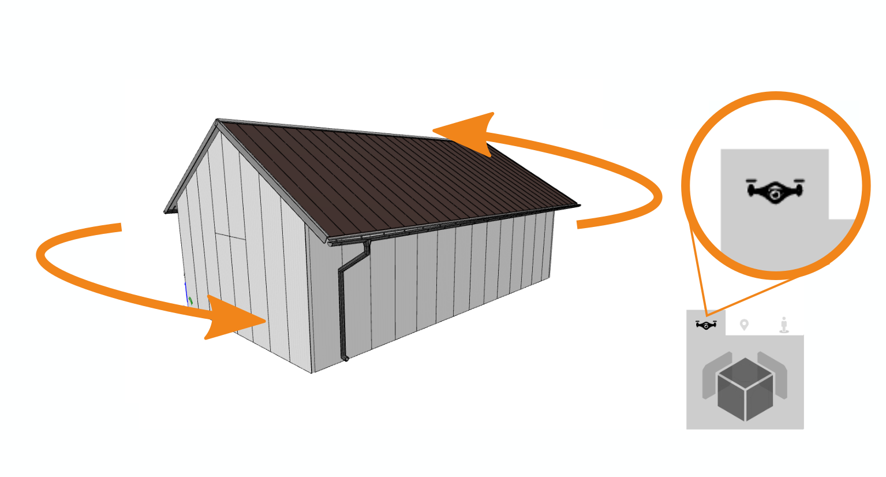
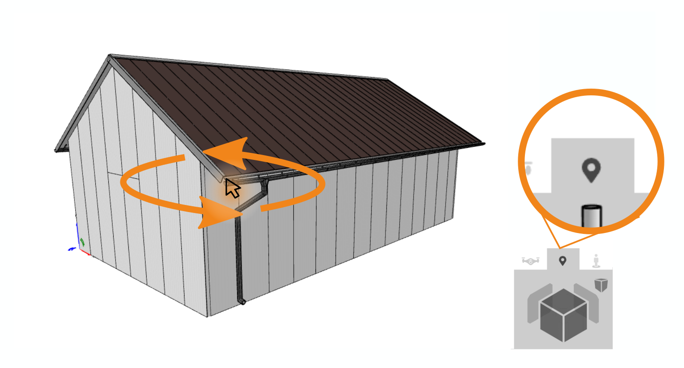
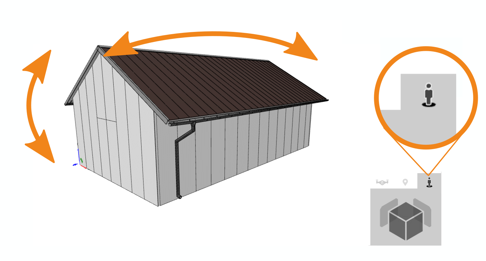

# Main

## Nabídka vlevo
### Insert

Toto tlačítko slouží k přidání objektu do prostoru pro modelování. Můžete zde přidat různé prvky, jako jsou obecné tvary, střechy, stěny nebo dokonce celé domy. Po kliknutí se zobrazí skupiny objektů, ze kterých můžete vybírat pro vaši práci.

### Tools
 

Pod tímto tlačítkem najdete nástroje pro kontrolu vašeho modelu. Můžete je využít k měření různých rozměrů vašeho projektu a také k práci s pracovní rovinou.

### Drawings

Toto tlačítko vám umožňuje spravovat a upravovat generované výkresy prostorového modelu.

### Reports 
 

Chcete-li spravovat výstupy z vašeho modelu, použijte toto tlačítko. Nejenže zde můžete zobrazit všechny výstupy, ale většinu z nich lze také upravovat.

### Libraries

Toto tlačítko slouží k editaci všech knihoven, které jsou potřebné pro 3D modelování. Pomocí něj můžete přidávat barvy, měnit střešní krytinu a nebo třeba přidávat textury k jednotlivým materiálům.

## Ovládání kamery
S touto inteligentní krychličkou můžete pohodlně přepínat mezi různými pohledy na model. Jednoduše zapínat a vypínat axonometrické zobrazení nebo měnit způsob otáčení kamery.

### Módy ovládání kamery
HiStruct nabízí 3 módy ovládání kamery, které jsou určené pro různé způsoby použití. Ovládání scény levým a pravým tlačítkem myši tak může vypadat odlišně, podle módu, který je aktivní.

#### Perspektiva dronu
Při pohledu na scénu "z dronu" otáčíme oběma tlačítky myši (nebo tapnutím a posunem prstu na dotykové obrazovce) modelem, který zůstává ve středu obrazovky. Celá scéna je tedy neustále vidět a zoomovaání probíhá vždy od nebo ke středu scény.

V tomto módu je šikovné také použití klávesy "A", jehož stisknutí zapíná/vypíná automatickou a neustálou rotaci modelu kolem středu.

#### Bodové zaměření
Tento pokročilý mód je vhodný zejména pro zkušené uživatele, kteří se chtějí umět zaměřit a blíže podívat na konkrétní místo modelu. Otáčení levým tlačítkem myši totiž probíhá kolem bodu, který určuje aktuálního poloha kurzor myši. Stejně tak zoomování probíhá k nebo od bodu, kam je zrovna umístěn kurzor. Tímto způsobem je možné přiblížit kameru ke zkoumanému detailu scény a otáčením ho prozkoumat ze všech úhlů. Nevýhoda bodového zaměření je, že celý model může "odjet" mimo scénu. 

_TIP_: Při použití tohoto módu je možné přepnout z perspektivního zobrazení na axonometrické. Toto sice není lidskému oku přirozené a vizuálně aktraktivní, ale může pomoci zejména při modelování  nebo zarovnávání linií, protože nezkresluje vzdálenosti.

#### Pohled z výšky člověka
V tomto módu se kamera posune do výšky očí člověka a otáčení modelem levým tlačítkem sleduje otáčení hlavy stojící postavy. Použití pravého tlačítka myši simuluje pohyb osoby kolem modelu.

_TIP_: Při zapnutí tohoto módu hned poté, co zvolíme pohled shora, se kamera ocitne uvnitř modelu a můžeme se rozhlížet, jako kdybychom stáli uprostřed budovy.

Poslední použitý mód se ukládá do paměti prohlížeče a budete ho mít aktivní při každém dalším otevření HiStructu.

## Ovládání hladin v modelu

V modelovacím prostoru lze zapínat a vypínat jednotlivé hladiny 3D modelu. Model je rozdělen na jednotlivé objekty, které mají své hladiny. Kliknutím na tlačítko s názvem hladiny v pravé části obrazovky je možné jednotlivé hladiny vypínat a opětovně zapínat. Stejně tak je možné globálně zapnout či vypnout veškeré hrany či plochy v modelovacím prostoru pomocí tlačítek v horní části této sekce.

 
