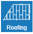

# Vítejte v konfigurátoru střech HiStruct Roofs!

Zde můžete snadno vytvořit model a odeslat poptávku na vaši novou střechu.

Tlačítka na pravé straně obrazovky vás provedou jednotlivými kroky zadání. 

## Krok 1: Půdorys
 

Nakreslete obrys střechy v půdorysu a nastavte typy hran obrysu. Řešič střechy se postará o korektní geometrii.

## Krok 2: Krytina

Vyberte jednu nebo více skladeb střešní krytiny podle vašeho přání.

## Krok 3: Lemovky

Vyberte typy lemovek, přidejte svody a upravte jejich umístění.

## Krok 4:  Poptávku

Odešlete poptávku spolu s celým modelem svému oblíbenému dodavateli.

## Jste výrobcem střešní krytiny?

Konfigurátor HiStruct Roofs lze rozsáhle přizpůsobit. Systém kladení střešních tvarovek, lemovek, oplechování a okapového systému je nastaven pro každého konkrétního výrobce zvlášť v samostatné sadě konfiguračních souborů. Obsahuje informaci o tom jakým způsobem je třeba střešní plochu tvarovkami vyskládat, dále možné barevné kombinace, informace k výkazu materiálu a další. Tyto a další přizpůsobení děláme v rámci [projektu pro přizpůsobení](customisationProject.md).
Spojte se s námi rádi s vámi projdeme vaše dotazy.

[Spojte se s námi](https://www.histruct.com/company/contact-us)
