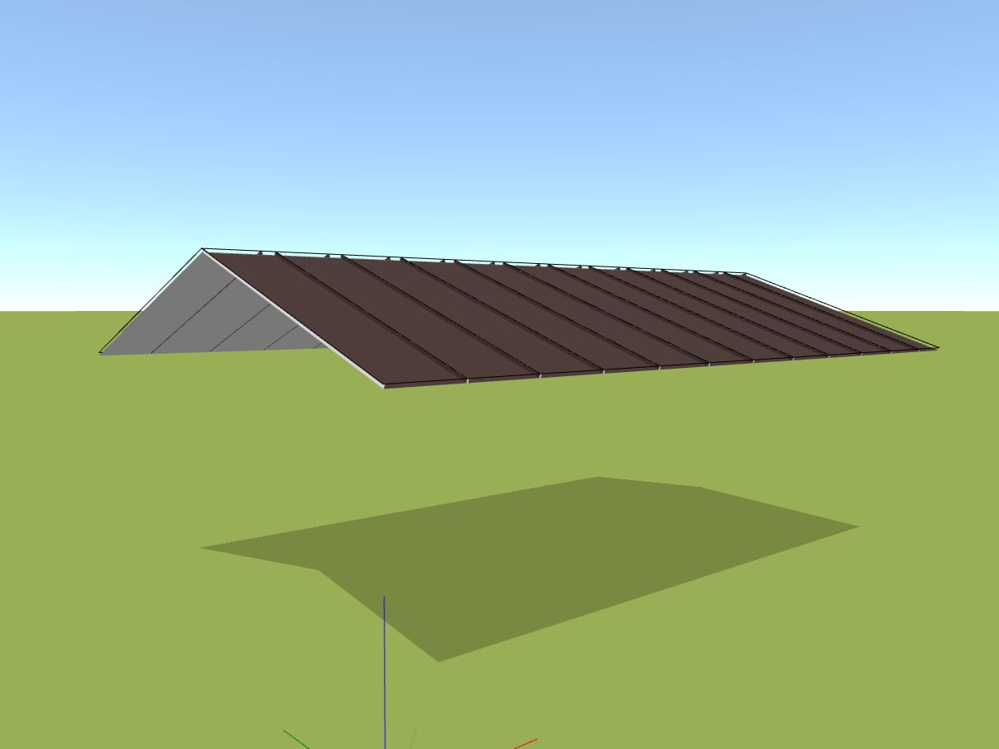

# Střecha   

Tato karta je klíčovým prvkem pro kompletní modelaci střechy, nabízí dvě významná tlačítka - *Plochy* a *Lemovky*, která vám umožní snadno a efektivně navrhnout střechu podle vašich představ.

**Tlačítko *Lemovky*** otevírá bránu k vložení kompletního okapového systému nebo libovolné lemovky z naší rozsáhlé nabídky. Umožňuje vám přidat nejen funkční, ale i estetický prvek ke každé střeše.

**Tlačítko *Plochy*** vám umožňuje vložit jednotlivé střešní roviny s lehkostí. Stačí jednoduše vybrat typ a vytvářet svou střechu krok za krokem.

Navíc pokud máte podklady ve formátu DXF nebo PDF, neváhejte je vložit do modelovacího prostoru.

[❔Nápověda pro import podkladů](importPage.md)

[❔Nápověda pro přidání střešní roviny](addRoofPolygon.md)

[❔Nápověda pro přidání okapového systému nebo lemovek](addFlashing.md)
