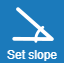

# Půdorys
Zde můžete zadat obrys střechy nabo již zadný obrys upravit.

##  Obrys střechy
Pokud jste ještě žádný obrys nevytvořili, můžete obrys zadat kliknutím na tlačítko Obrys. Tlačítko je nedostupné pokud už je obrys střechu zadaný.

##  Nastavení sklonu pro celou střechu
Sklon střešních ploch lze nastavit ve stupních pro celou střechu. Pokud potřebujete nastavit sklop zvlášť na některé střešní ploše, klikněte do modelu na některou obrysovou hranu a sklon nastavte tam.

##  Zvednout střechu
Zadanou střechu lze zvednout do prostoru o hodnotu platnou pro celou geometrii.

##  Smazat vše
Smaže celé zadání obrysu i násladných změn v dalších krocích zadání.

##  Další 
Pomocí tlačítka Další pokračujte na následující krok zadání.
