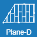

# Krytina
Zde můžete vybrat krytinu pro konfigurovanou střechu.

##  Zpět
Pomocí tlačítka Zpět se vrátíte na předchozí krok zadání.

##  Krytina
Zvolte krytinu pro celou střechu. 

##  Střešní plocha
Pokud potřebujete detailně nastavit kladení tvarovkami nebo zobrazit výkres a výkaz materiálu, vyberte tlačítko střešní plochy nebo klikněte na vybranou střešní plochu v modelu.

##  Další 
Pomocí tlačítka Další pokračujte na následující krok zadání.

Chybí vám v galerii některá krytina? Napište nám, doplníme ji.
