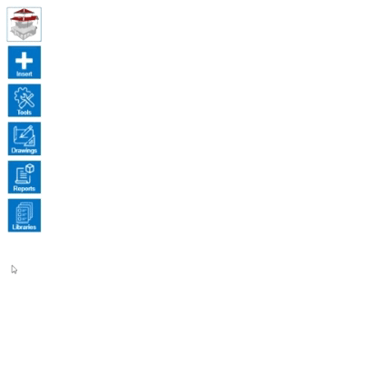

# Ovládání knihovny střešních krytin

Ovládání knihovny má podobné chování jako u jiné knihovny v HiStruct. Pro přidání střešní krytiny stiskněte v nabídce na tlačítko *Přidat*, čímž se vytvoří nová střešní krytina. U této krytiny je možné měnit *Typ* krytiny, čímž se otevře různá nabídka pro změnu parametrů. V této nabídce naleznete velké množství parametrů, které lze snadno upravovat.

 