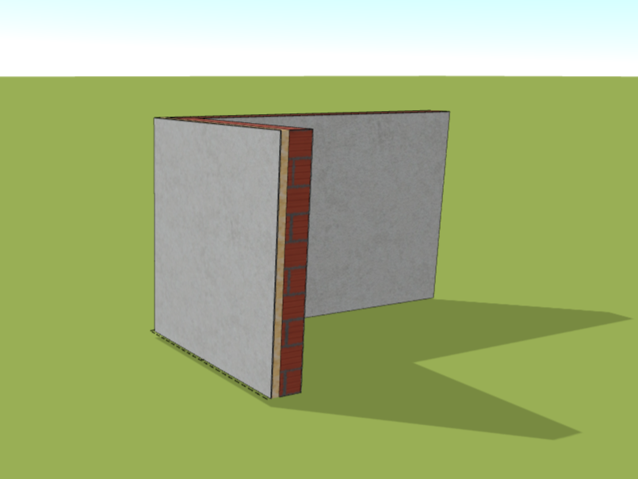

# Stěna   

Tlačítko *Stěna* vám umožňuje snadno přidat stěnu pomocí polylinie. Po přidání stěny můžete dále využívat naší knihovnu pro vytváření vlastních komplexních skladeb stěn, zahrnující izolaci, nosné prvky a pohledové prvky.

<!-- [❔Nápověda pro editaci skladby stěny](layersLibrary.md) -->

