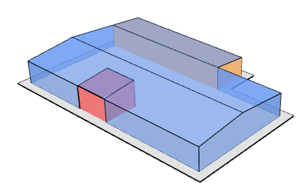
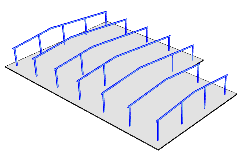

# Moduly

Montované haly jsou zpravidla navrženy pomocí konstrukce složené z hlavních rámů. Rozmístění hlavních rámů pak vychází nejen z funkčních požadavků ale také z požadavků plynoucích ze zvoleného typu opláštění, resp. schopnosti opláštění a sekundární nosné konstrukce přenést zatížemní na hlavní nosné rámy a dále do základů. 

