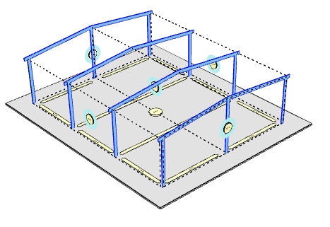

# Rozmístění hlavních rámů

Rozmístění hlavních rámů je částečně definováno tvarem haly. Podle směru hřebene se vyhodnotí které stěny jsou štítové a do nich se umístí hlavní rámy. Další rámy jsou pak vygenerovány mezi těmito štítovými stěnami podle nastavení maximálních vzdáleností mezi rámy ve výchozím nastavení. Počet a rozmístění hlavních rámů je možné změnit prostřednictvím tlačítek při okapových stěnách. Je umožňeno zadání počtu rámů a vzdáleností mezi nimi.

