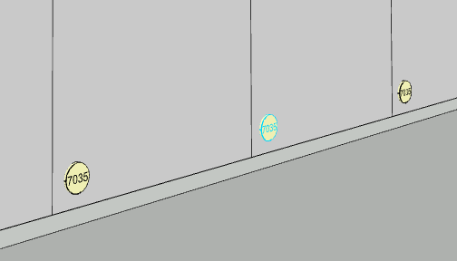
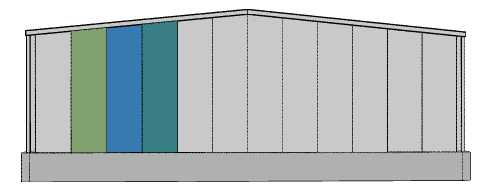

# Nastavení stěnového panelu

Každý stěnový panel lze vybrat přes kontextové tlačítko na vnější straně panelu a zvolit konkrétní barvu pro vnitřní i vnější povrch tohoto panelu.
Stěnový panel je podřízen [stěnovému segmentu](wallSegment.md).

Tímto způsobem lze tvořit libovolné barevné kombinace.

