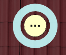

# 📏 Creating an Installation Drawing for the Roof Plane

The roof plane layout drawing is a key part of the building design process, allowing you to translate the design plans into a practical design on the roof. This drawing serves as a detailed guide for builders when installing a roof system and contains important information on material placement, joints and all technical aspects that are essential for a quality and safe roof construction.

In HiStruct, complete drawings for all roof planes are **automatically generated based on the 3D model. To edit these drawings:**

1.  In **Sheeting** **menu** simply navigate to a specific roof plane with **Edit button** which you can see directly on the specific roof plane

2.  Click on the **Drawings** button.

3.  You can now further edit the drawing: add dimensions, add labels, change name and scale in Properties tab.

## Adding dimensions

 You can enter a datum by clicking on the **Dimension button**, selecting the two points for which you want to plot a datum, and then specifying the distance of the plotting line. After clicking on the dimension, it is possible to:

- **Change its color**

- S**pecify the direction in which the dimension will be plotted**. The direction can be set to ***X*, *Y*,** or ***Default***, which will measure the shortest distance between these points. Alternatively, the ***Angle*** direction can be selected, which will plot the dimension at the selected angle.

- The last option in the dimension edit is the **Continue** **button**, which will generate another dimension in the same direction.

 **💡** If you want to **edit any point of your added dimension,** just **click on the dimension** and by moving the yellow points you are already editing the dimension**.**

**❓Where can I find and download the generated drawings?**\
Once generated and adjusted, the drawings are automatically included in the outputs. Go back into the main left-side menu:

- Go to **Drawings ⇒ Assemblies** in the main left-side menu. Here you can further edit the drawings - for example: add dimensions, add labels, or change the name and scale in the **Properties** tab.

- You can **download them** under the orange **Reports button ⇒ Sheeting BOM**, where the drawings are included.

- When you are in the specific drawing, you can download it as PDF using a camera button and then print it to PDF

⚠️ ***Note:** Certain functions like **Control** and **Edit buttons** are accessible only in **Advanced mode**. Check the [**Settings guide**](13_settings.md)* *for instructions on unlocking all features.*

**👉 Back to article  [*How to Work with Sheeting menu*](8_sheeting_menu.md)**

**👉 [*Return to main article*](index.md)**