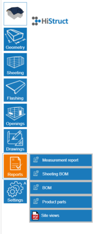

# 📐 Drawings, Documents, BOMs... Simply Outputs

Once your 3D model is ready, it's time to get your **outputs** - everything you need to prepare a polished offer for your client in just a few clicks!

## 📐 Drawings

Access the **Drawings** menu by clicking the **Drawings** button in the left-side menu. Then press the **Site Views** button to generate preset drawings showing the entire roof or wall structure, oriented according to the main **X, Y, Z axes**.

Here, you can generate and further edit drawings of roof or wall structures. Simply open the drawing you want to use.

Once a specific drawing is opened, you can further edit it:

- Change its **scale**

- Add **lines, dimensions**, **or labels**

- Measure any **distance** you need

This gives you full control over your technical documentation, ensuring every detail is clear and accurate.

## 🧾 Reports - Preparing Quote

Reports and price quote. What is normally tedious and time-consuming is just **a click away** in HiStruct. Every report is created automatically, saving time and effort.

**All outputs** - drawings, BOM (Bill of Materials), and other reports - update automatically when you make changes to the project, keeping everything current and accurate.

HiStruct produces reports in **.pdf**, **.html**, or **.docx** formats, ready to share or attach to your offer. Let's have a look at it in detail:

- **Measurement Report**

A document with all dimensions for individual wall or roof planes, as well as roof edges. Perfect for double-checking accuracy before construction or installation.

- **Sheeting BOM**

A detailed report of cladding elements for each roof or wall plane, including their layouts. This report is invaluable for installers, giving them a clear map of all panels and their placement.

- **BOM**

A tabular report of all sheet elements in the project. This allows quick review of quantities, parts, and material requirements - essential for planning, costing, and ordering.

- **Product Parts**

A comprehensive report of all roofing and flashing elements, including accessories such as screws and fasteners. This report helps ensure nothing is overlooked and that all components are accounted for.

- **Site Views**

A document with visual overviews of the modeled structure. These preset views are oriented according to the main **X, Y, Z axes**, giving your client a clear understanding of the overall project at a glance.

**👉 [*Return to main article*](index.md)**