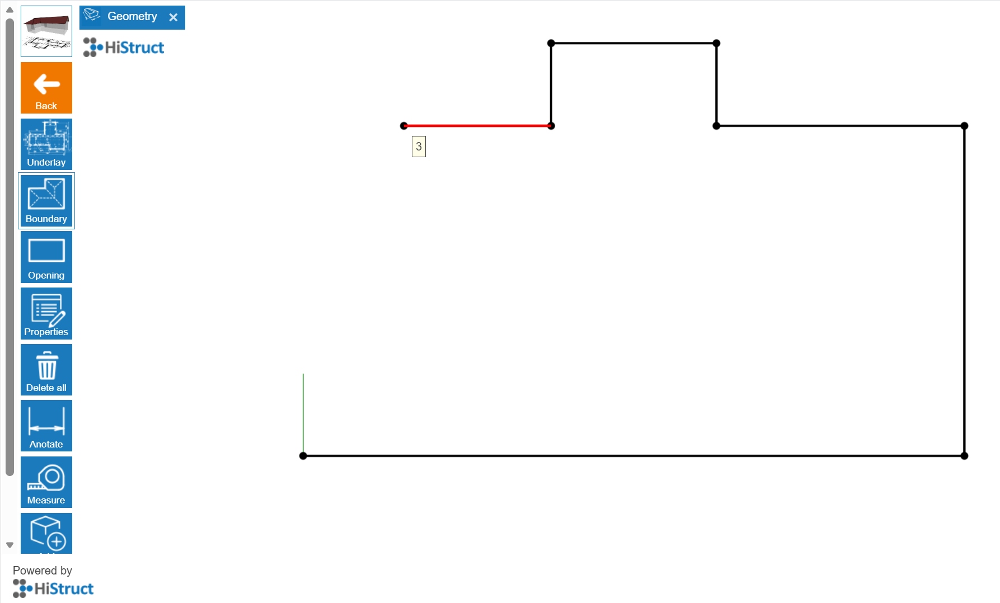
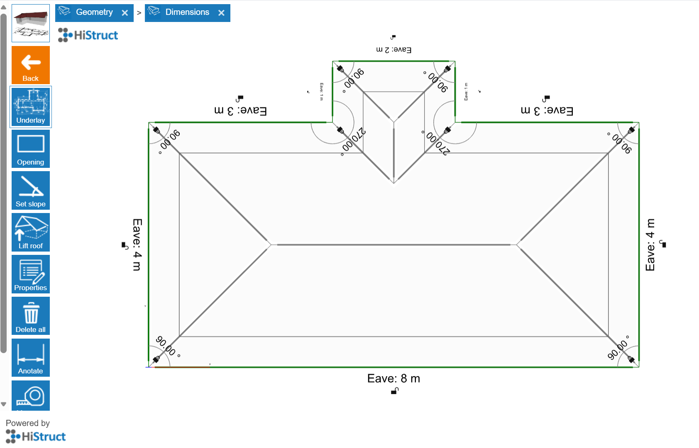

# 👉 How to Generate a Roof Shape from Outline and Start Drawing Directly

1.  **Click to Geometry card and choose the Boundary button.** This enables you to draw the shape of your roof. Click anywhere in the workspace, but it's usually easiest to click right on the starting point (the green and red coordinates).

2.  **Drawing with the cursor.** As you move the cursor, it can automatically snap along the horizontal (X - red) or vertical (Y - green) directions, or perpendicular to the last edge you drew.

3.  **Setting the length of an edge.** If you want a specific length, just type the number in meters and press **Enter**. The edge will instantly adjust to that length.

4.  **Closing the outline.** You can finish the shape by either reaching the starting point or pressing **Enter.**

## 💡Other ways to draw edges:

1.  **Setting up the global coordinates:**

- Enter the exact position of the next corner from a fixed starting point (0;0).

- For example, 2;4 means 2 meters to the right and 4 meters up from the origin point of the coordinate system.

2.  **Setting up the relative coordinates**

- Enter the position of the next corner relative to the last point you drew.

- For example, \@2;4 means 2 meters to the right and 4 meters up from the last point.

3.  **Setting up polar coordinates**

- Enter the next corner using an angle and distance, e.g., \>135;6.

- The angle is measured from the positive X-axis, counterclockwise.

## 💡Tips:

- If the drawn edges turn **pink**, it means a right angle is formed between them.

- You can delete the last point anytime by pressing **DELETE**.

And that's it! You can now see your roof almost done. In next steps you will choose sheeting, flashing, add openings and generate outputs. 

**👉 [*Go to nexts steps*](8_sheeting_menu.md)**.

**👉 [*Return to main article*](index.md)**

