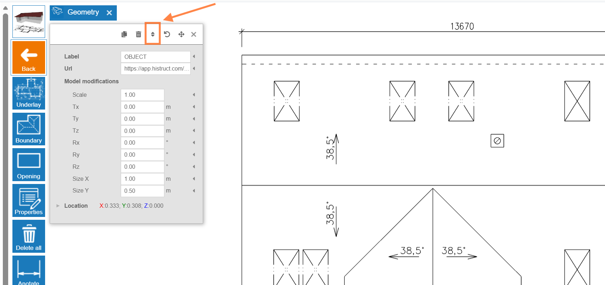

# 👉 How to Insert Your DXF Files for Accurate Modelling? 

1.  **Choose the Underlay button** and click on **Import \*.dxf**. This will open a dialog box where you can upload your drawing.

2.  **Specification of insertion point.** After selecting the file, you need to specify the insertion point of the drawing by clicking into the scene.

3.  **Setting the correct scale of the drawing.** Since the drawings are in different scales, it is first necessary to set the correct scale to make the model match the actual dimensions (You can set the scale by clicking the grey rectangular button in the modelling space after importing the file):

> 

a.  First, click on the **Scale** button..

b.  Click on two points for which you know the real distance on the drawing.

c.  Then enter the desired distance and press **Enter**.

d.  Click on **Proceed**, and the software will automatically calculate the scale.

>
> **💡If you have set the correct scale value, then the measured values will match the lines from the drawing.**

4.  **Drawing the roof**. Simply click on Boundary button and trace over the imported roof plan.

> And that's it! You can now see your roof almost done. In next steps you can choose sheeting, flashing, adjust openings and generate outputs.

**👉 [*Go to next steps*](8_sheeting_menu.md)**

**👉 [*Return to main article*](index.md)**
