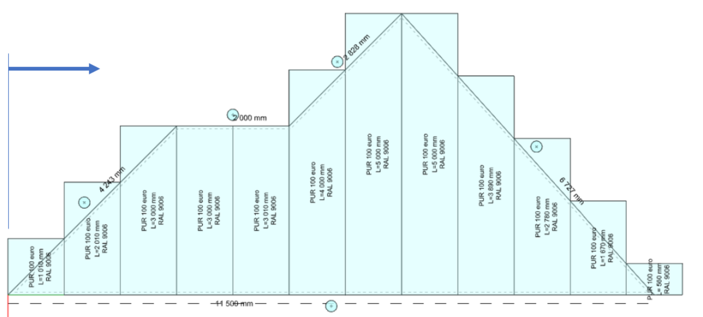
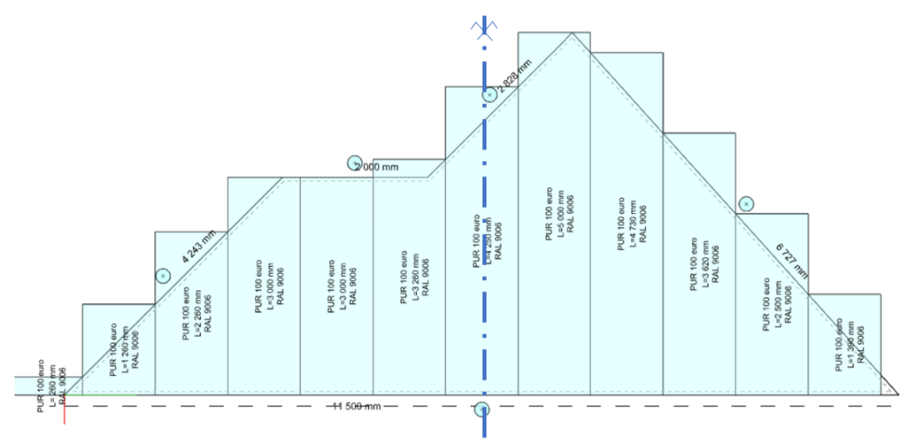
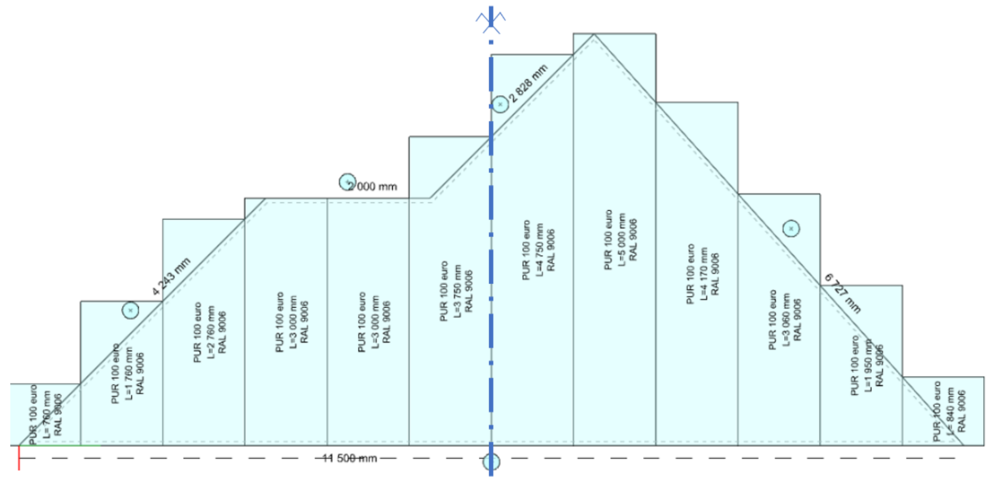
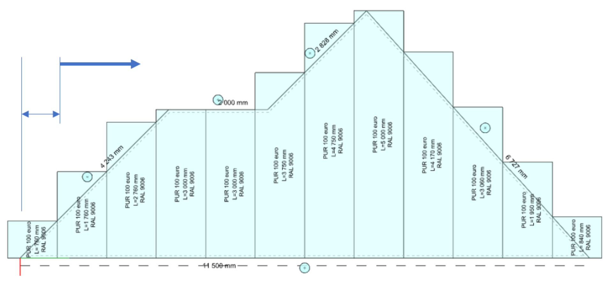
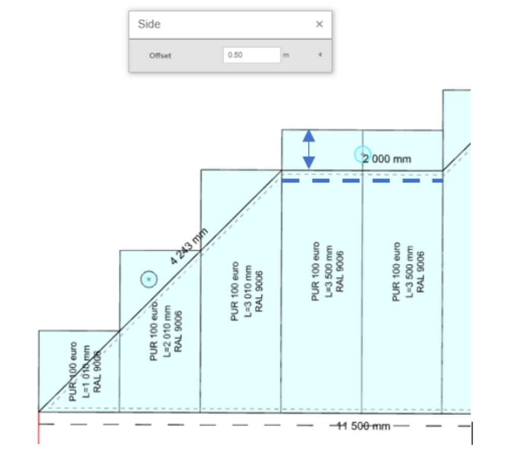

# 🛠️ Quick and Easy Tiling Adjustment

HiStruct Roofs automatically places the selected roofing material along the flat surface. **Once generated, the strips can be modified and adjusted as needed.**

**💡 To see how individual strips are laid out**, go to the **Sheeting** **menu** ⇒ click the **Edit button** for the roof covering layer placed directly on the roof model [see previous guide](8_sheeting_menu.md) ⇒ and press **Tiling** button in left-side menu.

⚠️ ***Note:** Certain functions like **Control** and **Edit buttons** are accessible only in **Advanced mode**. Check the [**Settings guide**](13_settings.md)* *for instructions on unlocking all features.*

📌 **Now you find yourself in editing mode. You can:**

- Edit the whole tilling

- Edit individual strips

 **Laying direction**

 It is configurable, choosing from the following types:

- **positive**

 

- **negative**

 
- **center the tile**

 

- **center the joint**

 

- **general specification of the start of laying (laying positive + distance)**

 

 **The angle of the laying of the strips**

 **It is adjustable as positive or negative offset from the baseline.**

 {width="6.3in" height="3.2083333333333335in"}

 **Each specific strip**

- **disable ( then it is not reflected in drawings, detailed model or material reports.)**

 

- **lengthen or shorten the overlap**

 

- **overlay in appropriate places (according to the grid of the slats) Clicking on the indicated divisions above the slats can split the strip or, conversely, merge it if it has already been split.**

 

 **Lengthening or shortening panels at the sides**

 For each side of the roof polygon, you can set the panel lengthening or shortening by clicking on the button above the edge.

 

**👉 Back to article  [*How to Work with Sheeting menu*](8_sheeting_menu.md)**

**👉 [*Return to main article*](index.md)**
