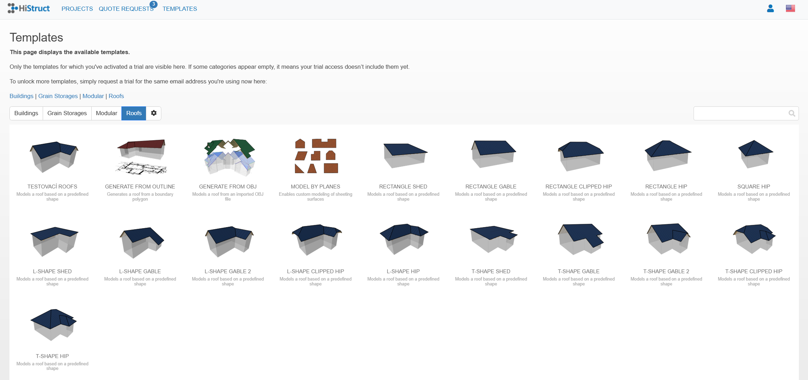

# 🏠 How to Start Roof Modelling with a Template

If you want to model simple standard-shaped roof and have the dimensions available, one of easiest ways how to get your roof model is to use one of our predefined templates:

1.  When creating a new project, select a suitable template from the predefined templates offered. Or directly open the **Templates** in upper left side of the HiStruct menu and choose suitable roof template. The chosen template will open directly in application.

2.  Click on **Geometry** card to define basic dimensions of the building, building height and roof slope. You can also move the eave to change/switch the eaves edge

> And that's it! You can now see your roof almost done. In other steps you will choose sheeting, flashing, add openings and generate outputs.

**👉 [*Go to next steps*](8_sheeting_menu.md)**

**👉 [*Return to main article*](index.md)**
