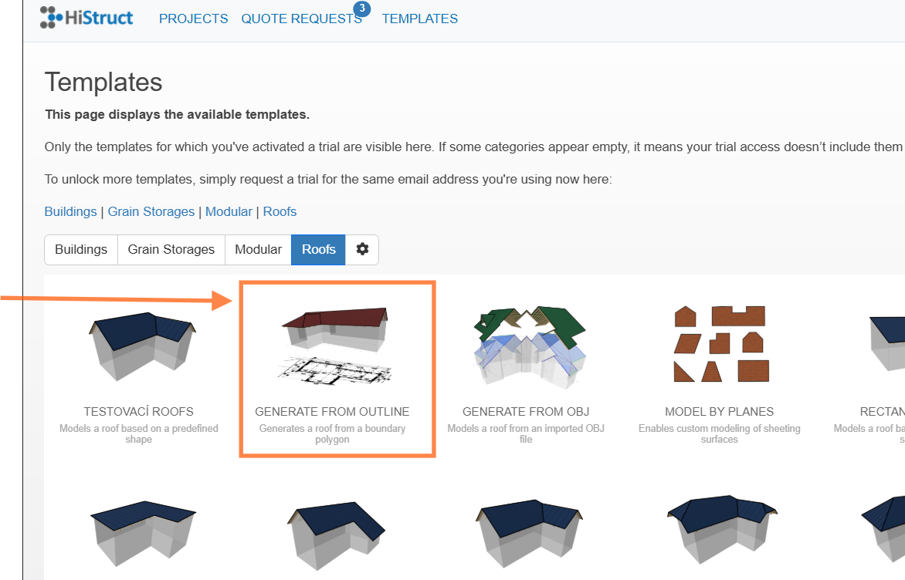

# 🏠 How to Generate a Roof Shape from Outline & Using DXF Drawing for Accurate Modelling

If you have a hand-drawn sketch, you can simply generate the roof from its outline. And if you happen to have a vector drawing in **.dxf** format, that's even better - inserting it into the modeling space will make your job much easier and you're already halfway there! This base will allow you to draw your roof more accurately and, thanks to automatic cursor snapping, will also improve the precision of your model.

**❓Don't have a drawing in \*.dxf but only in PDF format? Never mind!** Most line drawings can be easily [converted to \*.dxf](4_PDF_to_DXF.md) 

🚀 **Let's get started!**

> When creating a new project, select the option **Generate from outline.**  Alternatively, you can directly open the **Templates** in upper left side of the HiStruct menu and choose this option as well. You'll enter the application directly and jump right to **Geometry** menu.
>
> **👉 Now you have two options:**
>
> 😊 Start drawing directly  **👉See [this article](14_generate_from_outline.md)**.
>
> 😊 😊 or insert your files in DXF for accurate modelling **👉See [this article](15_insert_DXF.md)**.

**👉 [*Return to main article*](index.md)**

