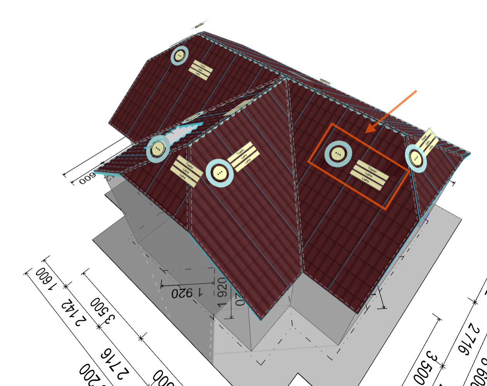
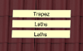

# 🧱 How to Work with Sheeting menu

In this step, you will **set the type of roof system and roofing**.

In the **Sheeting** menu you can see three basic buttons in left side menu - **Roof**, **Annotate** and **Measure** and also very important **Control** and **Edit buttons** placed directly on each individual roof plane.

The **Sheeting menu** allows you to:

- Set the type of roof system and roofing.

- Choose the secondary roof structure

**For each individual roof plane, you can:**

- Change the **tiling parameters** (the direction, angle, and offset for the placement of roof elements from the edge of the roof).

- Display a **bill of materials** for roof covering items.

- Generate a **ground plan of the roof structure** in the form of an editable drawing. 💡**Tip:** When you modify this drawing, the changes are automatically reflected in all outputs where it is included.

## 1️⃣Setting the type of roof system and roofing

Click the **Roof button**. Two additional buttons will appear: **Top layer** and **Lower layers**. Use these buttons to select the material for each layer from the product library.

**📌 This way, you are** **working with the roof as a whole.**

If you want to **work with individual roof planes** and adjust their properties, use the **Edit** and **Control buttons** located directly on each roof plane in the model. These buttons allow you to modify the roof structure of the selected roof plane and more.

## 2️⃣Changing properties of individual roof planes using Control and Edit buttons

Settings and modifications of individual roof planes can be made using the **Control** and **Edit buttons**.

⚠️ ***Note:** Certain functions like **Control** and **Edit buttons** are accessible only in **Advanced mode**. Check the [**Settings guide**](13_settings.md)* *for instructions on unlocking all features.*

**Control button**   

Once you click the round **Control button**, several additional buttons appear in the left menu:

- **Properties**\
  Use the **Properties** button to **name the selected roof plane** and adjust other parameters of the specific roof plane.

- Use the **Materials** button to select the material for each layer from the product library. For some coverings, the **Lower layers** button may be hidden by default, and the secondary structure is therefore not generated for such a covering.

- Press the **BOM (Bill of Materials)** button to display a list of roof covering items for the respective roof plane in a clear table.

- Use **Drawing** button to generate a installation drawing of the specified roof plane, including the entire composition of the roof structure.

**💡How to generate and edit the installation drawing.** 👉  [See this article for more information](11_installation_drawings.md).

**Editing Buttons** 

The **Editing** buttons are located directly on the roof model, right next to the **Control** button. By clicking the specific **Edit** button, you can access and edit the selected roof layer. For each layer of the roof on the selected plane, you can:

- choose the type of roof covering or secondary structure layer, and adjust its **size, position, direction, and angle**.

> **💡For roof covering layers, you can also adjust the tiling in detail (see below)**

- create a simple floor plan of the layer as an editable drawing

- and, for roofing, display a bill of materials of this layer

**📌** The available options may vary depending on the type of roofing or secondary structure.

**💡How to edit tiling - Quick and easy tiling adjustments👉**  [See this for more information](16_tiling_adjustment.md).

**👉 [*Return to main article*](index.md)**
