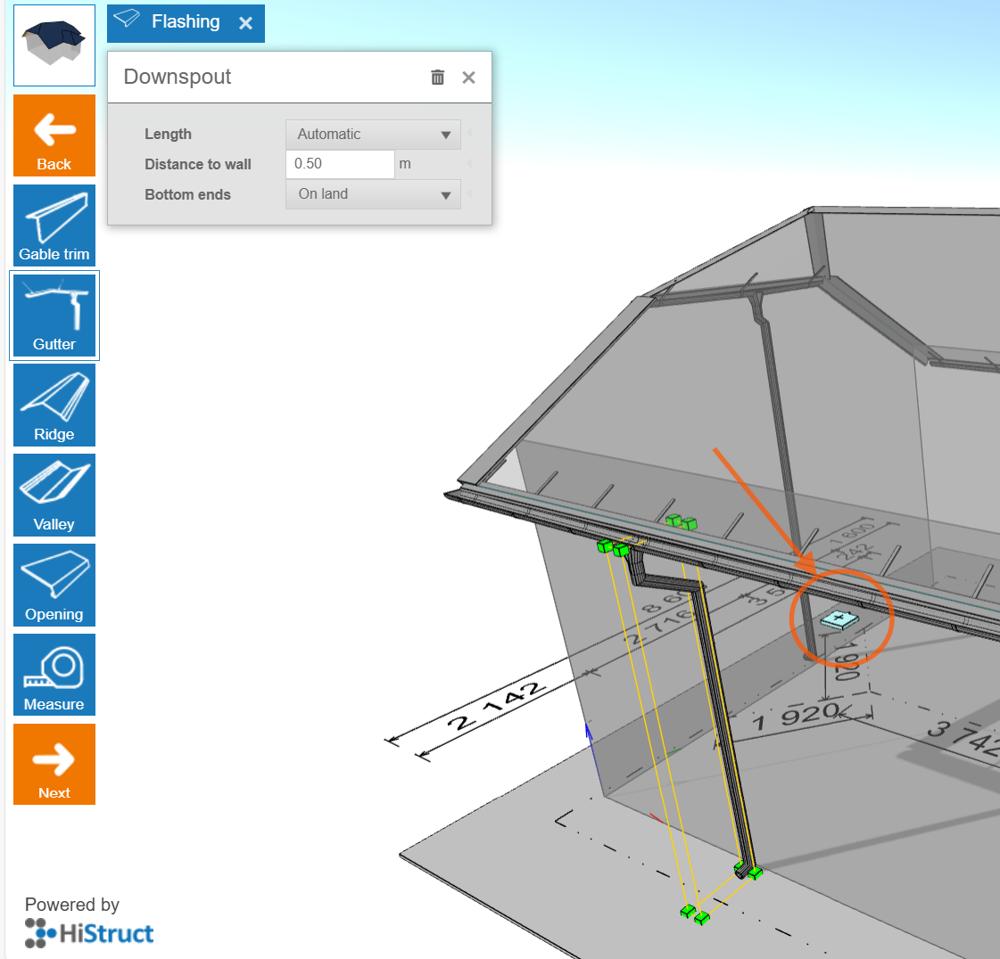

# 🌧️ Flashing and Gutter System - Mastering the Details

> In Histruct, flashing and gutter system are generated automatically. In **Flashing** menu, you can modify individual flashing and gutter system elements, including their material and colour.
>
> **💡Adjustments can be made in two ways:**

- Edit groups using the buttons on the left

- Edit individual elements directly in the 3D model

> ⚠️ ***Note:** Certain functions like **Control** and **Edit buttons** are accessible only in **Advanced mode**. Check the [**Settings guide**](13_settings.md)* *for instructions on unlocking all features.*

## 1️⃣Editing groups of elements using the buttons on the left

> On the left side of the screen, you'll find dedicated buttons for each group of flashing elements. By selecting one of these buttons, you can change the material and colour of the entire group at once. The number of listed flashing groups depends on the specific roof model and its geometry.
>
>**Available groups typically include:**

- Gable trim

- Gutter

- Drip

- Ridge flashing

- ... and more, depending on your model.

> 💡 All changes you make will be applied to every element within the selected group. This makes it fast and efficient to keep your roof design consistent.

## 2️⃣ Editing individual elements directly in the model

> For maximum flexibility, you can edit elements individually by clicking directly on them in the 3D model. Once an element is selected, the *Flashing panel* opens, allowing you to:

- **Extend the element** by a specific length, either from its start or end.

- **Change the material or colour** using the options available in the gallery.

- **Adjust the flashing type** if automatic recognition fails.

> This method is perfect when you want to fine-tune small details or apply different settings to unique parts of the roof.

## Adjusting the gutter geometry

> In addition to the automatically generated flashing and gutter system, HiStruct gives you advanced editing options for gutters and downspouts. You can edit them just like any other flashing element - simply click on a gutter in the 3D model, and the **Flashing panel** will open. From there, you can easily customize the gutter system to match the exact requirements of your project.

- **Change distance to wall:** You can change the distance of the downspout, allowing you to add elbows and bring the gutter closer to the wall.

- **Extend downspout**: The downspout can be extended either via the dialog box or by simply dragging the green dots on the downspout.

- **Changing the position of the gutter** - drag and drop - You can also change the position of the gutter easily by selecting the gutter and then simply moving it with the mouse.

> This flexible editing ensures the gutter system fits your building's exact needs.

## Adding a gutter downspout

> In HiStruct, gutter downspouts are generated automatically to ensure sufficient runoff from the gutter. However, if you need, you can add an additional downspout:

1.  Click the **plus button**

2.  New downspout will be added to the selected gutter

3.  You can further move the newly created downspout and also edit it by clicking on it like any other flashing element.

> **And that's it! Your model is almost ready! In next steps, you can move on to adding windows and other openings. 👉 Go to [nexts steps](10_openings.md)**.
