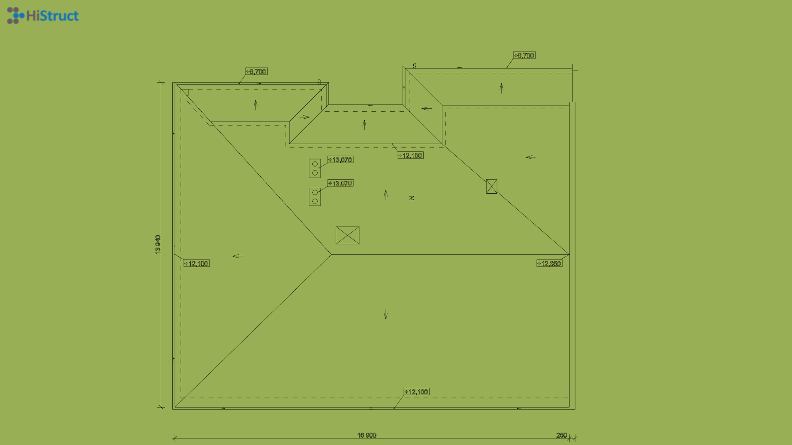
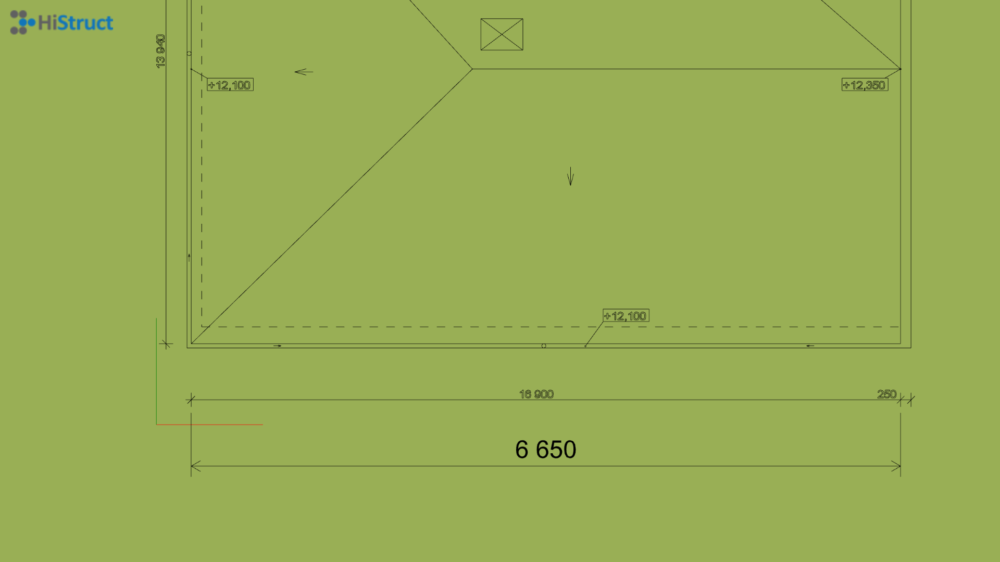
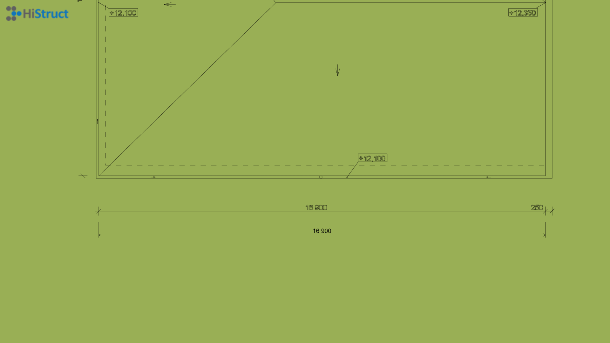
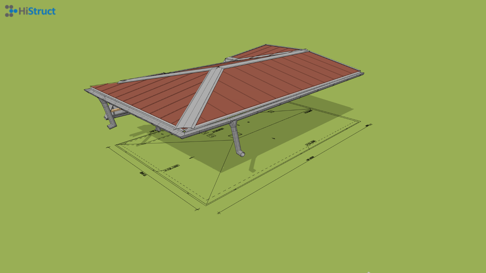

# 📐 Insert DXF drawing into HiStruct for accurate modelling

If you have any line base for your roof, inserting it into the modeling space will make your job much easier. This base will allow you to draw your roof more accurately and, thanks to automatic cursor snapping, will also increase the accuracy of your model. Don't have a drawing in DXF but only in PDF format? Never mind most line drawings can be easily [converted to DXF](convertPdfToDxf.md).

Let's take a look at how to insert such a drawing...

## How to insert DXF into HiStruct?

1. Open the *Substrate* tab and click on the *Import \*.dxf* button. This will open a dialog box where you can upload your drawing.
2. After selecting the file, you need to specify the insertion point of the drawing by clicking into the scene.

## Setting the correct scale of the drawing
Since the drawings are in different scales, it is first necessary to set the correct scale to make the model match the actual dimensions.

1. First you need to measure one of the known edges using the *Measure* button.
2. Calculate the scale as the actual length divided by the measured length.
3. Click on the inserted drawing and change its scale in the *Properties* tab.

If you have set the correct scale value, then the measured values will match the lines from the drawing.

## From drawing to complete roof
Now that we have imported the base as a DXF, it is possible to model the roof in the usual way, either using individual roof planes or using our automatic solver, which creates the roof just from the contour polygon of such a roof.

