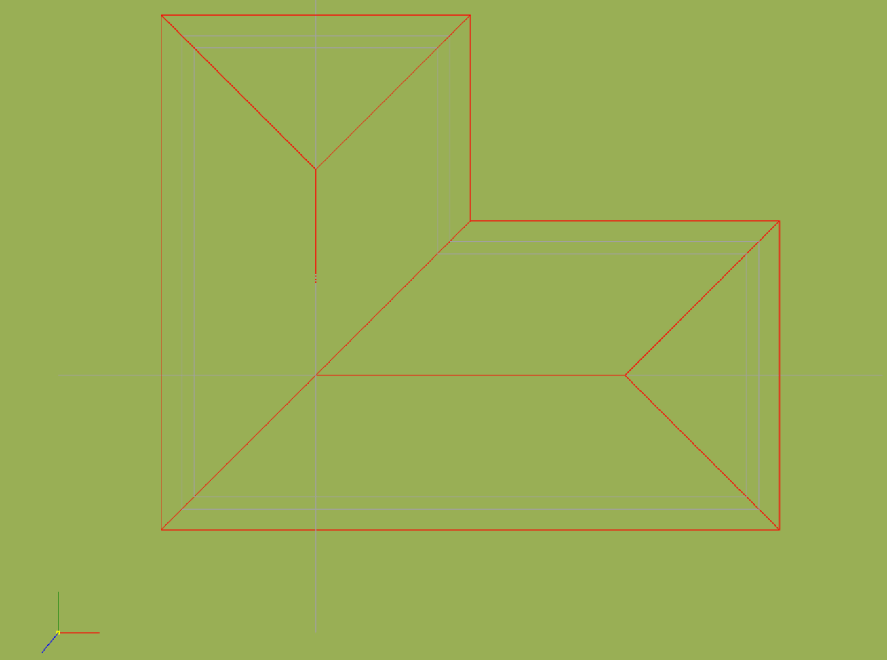
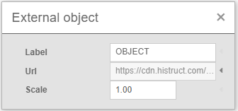
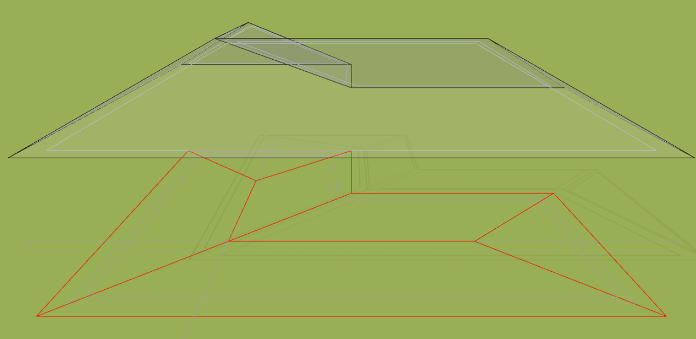

# Import DXF drawing

Whether you are going to model a roof or a whole house, using a drawing will make your job much easier. A drawing will make it easier. Why? Well, not only can you simply snap your cursor to points on the drawing, but you also maintain control over the shape and size of each element you model. But how to do it? Trust me, it's easy if you follow a few simple steps.

## How to prepare your drawing before inserting?

### Highlight important elements
Your pasted drawing will usually only consist of lines, so it's wise to highlight the important parts of your drawing with different colors.

### DXF file version and size
HiStruct supports most versions of DXF files, but I recommend choosing files up to 2 MB in size for maximum speed when editing your model.

### Supported DXF file objects
Various object types are supported in our tool, such as *LINE, LWPOLYLINE, POLYLINE, SOLID, POINT, INSERT, SPLINE, CIRCLE, ARC* and *ELLIPSE*.

### Ready to insert drawing
If you follow the above tips, the drawing may look like this, for example. I highlighted the important edges of the roof in red and removed unnecessary objects. This not only makes it faster to create the model, but also gives me peace of mind when working and I don't have to worry about distractions.

## How to insert a DXF drawing into HiStruct?

If I have a drawing ready, I can easily insert it into my project. Just click on the *Import* button and select the **.dxf* file.

### Selecting the origin
Now I just need to click into the scene and select the point where I want to place the start of my drawing.

### Scale adjustment
If my drawing is in units other than meters, that's fine. I can simply adjust the scale using the *Edit* button.

### Drawing location
I can work with the inserted drawing just like any other object. I can pan or rotate it.

## How do I create a model from a drawing?
You can snap to the imported *.dxf, then specify individual roof surfaces by clipping the floor plan [using a generic shape](modellingRoofs.md) with the addition of a slope for each roof surface.

In this way I can create an accurate 3D model on which to almost always run the [flashing and gutter generator](roofFlashingGenerator.md)

