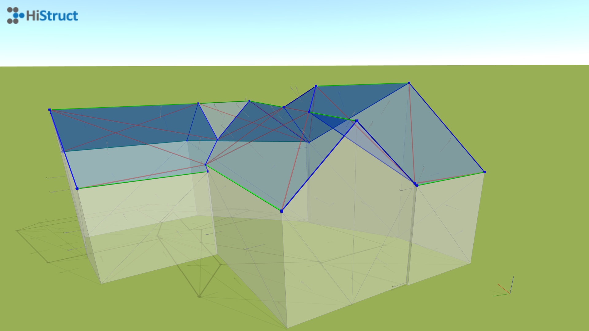

# 🏠 Using the OBJ model to automatically generate the roof
With the development of BIM technology, we are increasingly seeing construction projects having their own 3D model, often before they are actually implemented. However, if a building does not have such a model, there are companies that offer surveying of existing buildings. Regardless of whether the surveying is done with drones or satellites, the result is usually a detailed 3D model in OBJ format, if you don't have an OBJ model, see how to [convert] the model to this format(convert3dPdfToObj.md). The resulting model can look like this:

## How to insert OBJ into HiStruct?

To make the most of the OBJ model, we recommend using our innovative automatic roof generator. It can recognize the individual roof planes in the OBJ model and assign them the correct edges, slopes and properties.

1. Click on the *Import \*.obj* button. This will open a dialog box where you can upload your model.
2. After selecting the file, you need to specify the insertion point of the model by clicking into the scene.

### Editing a recognized 3D model

Even if our generator is almost flawless, there may be edges and variants that it does not always recognize correctly. Therefore, you have the possibility to correct the recognizer and adjust the properties of each edge.

- Click on any edge to adjust its properties.
- In the same way, you can change the properties of each recognized plane. If you do not want to generate a roof on a plane, you can modify its properties.

**The individual edges are color coded into 3 groups according to their function:**

- **Blue edges** : Oblique bounding box for individual roof planes.
- **Green edges** : Horizontal edges such as the roof ridge or eaves edge.
- **Red edges**: Edges that are ignored when generating a roof because they lie in some roof plane.

**Individual faces are color-coded into 2 groups according to function:**

- **Blue areas**: The plane on which the roofing will be placed.
- **White areas**: The plane that is not part of the roof.

## How to generate a roof?

Generating a roof is now easy. Just use our roof generator by clicking on the *Next* button. The generator will guide you through the process and help you easily generate the roof you want, including accessories.

