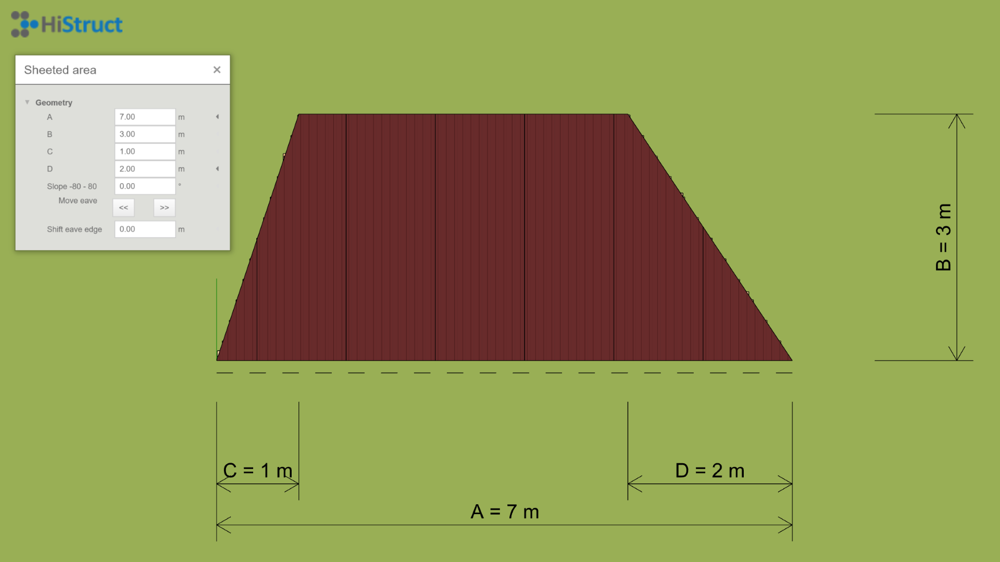

# Roof plane modelling
Modeling the roof plane is one approach to creating the entire roof model. There are two methods for doing this. If I intend to draw a simple shape, it's easiest to select one of the predefined shapes. However, if the shape of the roof plane is more complex, it is advisable to use a general roof shape.

## Predefined shape
We'll demonstrate how to create a roof plane using predefined shapes on a roof plane that is trapezoid shaped. In the menu of predefined shapes, I select the appropriate shape, i.e. *Trapezoid*, and click to insert the selected shape into the scene. However, now I need to change the dimensions of this trapezoid to match our roof plane. I do this by clicking on the *Edit* button, where I can easily change the individual dimensions of our trapezoid.
If I have a sketch with the roof dimensions already in the slope, this is easier, and I don't have to deal with any further geometry adjustments and just rotate the roof plane by the angle I need. However, if the dimensions of my roof are only in plan view, it is necessary to add a slope to the roof as well. I can enter the slope in degrees and use the arrows to select the direction in which the slope will be set. In a similar way, I add the remaining roof planes to model the entire roof
  

## General shape
Adding a roof plane using a general roof shape brings a lot of variability, and with the use of some clever functions for [add polygon](insertPolygon.md), it's easy too. Creating such a plane is done with just selecting the individual vertices of the roof plane. This makes it easy to model any roof plane shape. Again, I can raise the roof plane to the desired slope or just rotate the plane by the desired slope. In the same way I add the remaining roof planes to create a complete roof.
  

