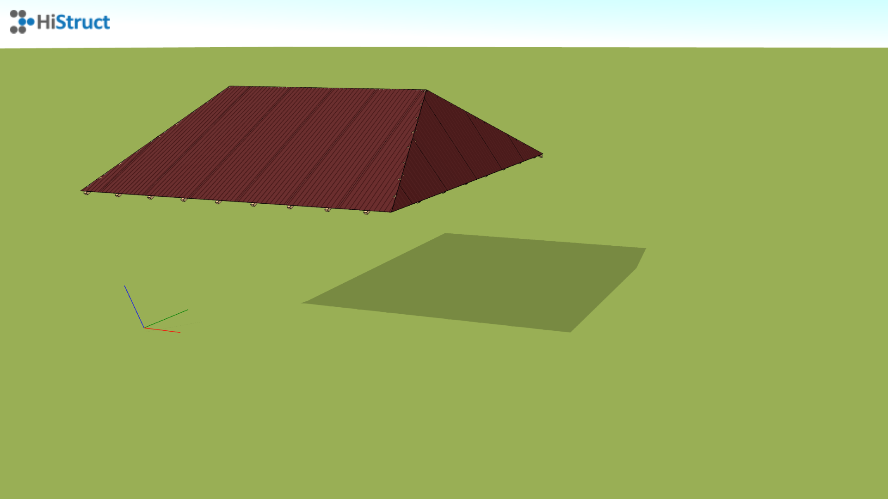
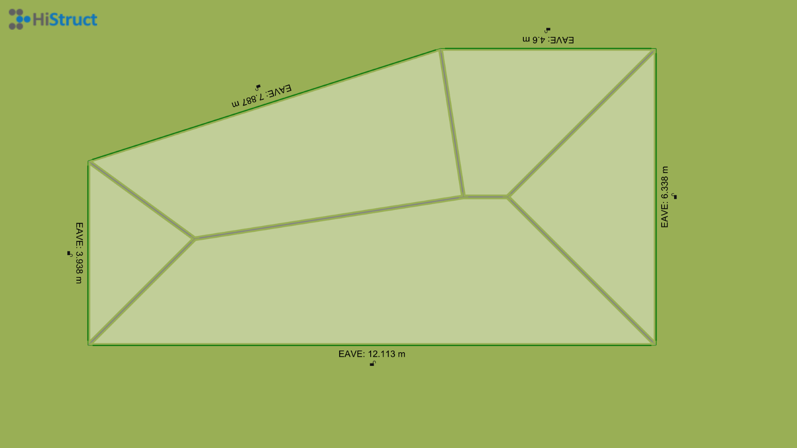
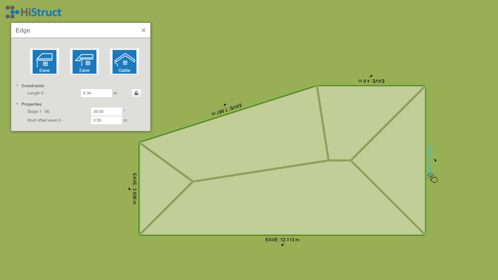

# 🏗️ Step by step modelling of roof planes in HiStruct
Drawing a roof plane is one of the ways you can model the entire roof. There are two ways in which this can be done. If I want to draw a simple shape, it is easiest if I select one of the predefined shapes. However, if the shape of the roof plane is more complex, it is advisable to use a generic shape.

## Surface modelling

### Predefined shape
We will demonstrate how to create a roof plane using predefined shapes on a roof plane that is trapezoidal in shape. In the predefined shapes menu, I will select the appropriate shape, i.e. *Lihedral*, and click into the scene to insert the selected shape. However, now I need to change the dimensions of this trapezoid to match our roof plane. I do this by clicking on the *Edit* button, where I can easily change the individual dimensions of our trapezoid.
If I already have a sketch of the roof with a slope, the process is easier because I don't have to deal with additional geometry adjustments. I just need to rotate the roof plane by the desired angle. However, if the roof dimensions are only shown on the floor plan, the slope must be added. The slope can be entered in degrees and the arrows can be used to specify the direction in which the roof will be tilted. The dashed black line indicates the eaves edge towards which the roof surface is tilted according to the selected slope. I will add the other roof planes in the same way to model the entire roof.
  

### General shape
Adding a roof plane using a generic shape brings a lot of variability, and with the use of some clever functions for [add polygon](insertPolygon.md), it's easy too. Creating such a plane is done with just selecting the individual vertices of the roof plane. This makes it easy to model any roof plane shape. Again, I can raise the roof plane to the desired slope or just rotate the plane by the desired slope.
  

### Complete roof
In the same way, I add the remaining roof planes and create a complete roof by incrementally adding each roof plane. Rotating them by the correct angle and setting the correct height. On such a model you can usually run the automatic [flashing and gutter generator](roofFlashingGenerator.md).

## Generate from outline
### Roof outline
The second possible approach is to generate the roof from the outline only. First you need to draw the outline of the roof. To do this, it is of course possible to import [*.dxf format files](importDxf.md), or convert vector [*.pdf to *.dxf](convertPdfToDxf.md) and [import them into HiStruct](importDxf.md). Thanks to the background, I can easily draw any roof outline

### Generating roof ridges
Immediately after drawing a roof outline, the ridges of that roof will be automatically resolved. This will generate a hipped roof for which various properties can be changed.

### Modifying individual roof edges

All drawn contour edges can be easily edited. Each edge can be assigned a set of parameters according to its type. First, you can change the edge type from the default eave edge, for example, to a gable edge or a raised eave edge. To make this choice, simply click on the corresponding image. You can then set the overlap of the roof plane or, in the case of a gutter edge, the slope of the adjacent roof plane.

### Generate the entire roof

By setting the individual edges and their parameters correctly, the entire roof can then be easily generated. In addition, the generator also automatically generates all necessary [flashings, flashings](roofFlashingOptions.md) and [gutter system](roofFlashingGutterOptions.md).

