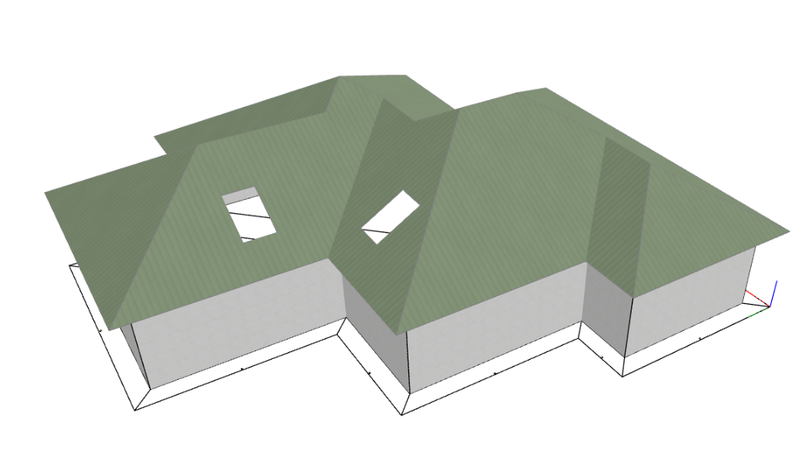

# 🚀 How the HiStruct trim and gutter generator works

It is mainly designed to **save time** for making 3d model of flashings and eaves for imported or specified roof plane geometries.

The generator can also be used in general for plane geometries that are entered from a drawing or completely by hand and just modified to best fit the edges of the roof planes to be touched. It does not have to fit completely, just fit within normal tolerances.

HiStruct automatically identifies the required flashing locations from the geometries of nearby roof planes, and then generates the corresponding flashing types. These generated flashings can then be further modified as required.

