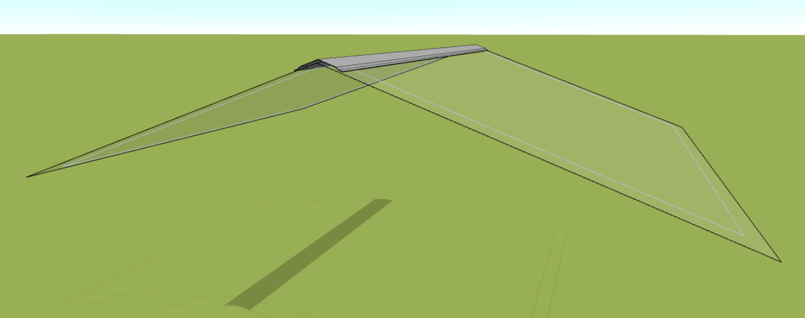
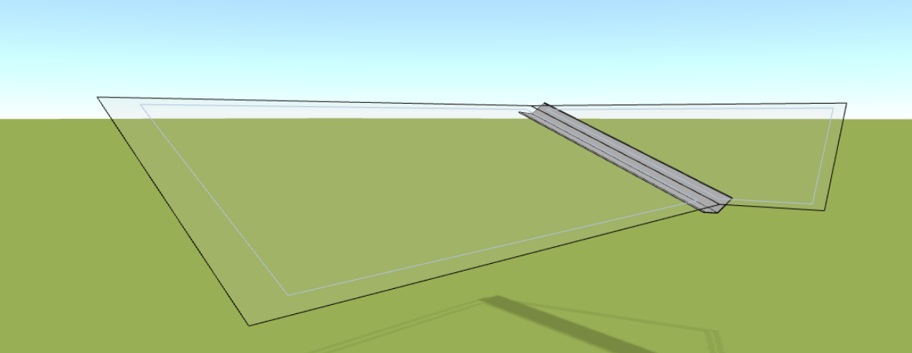
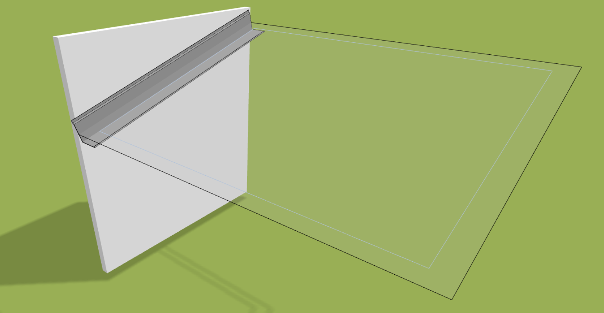
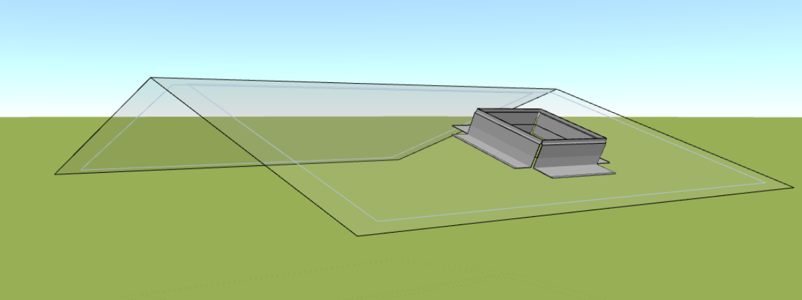

# Roof cladding and flashing

Roof sheathing and adding flashings to a roof design are essential steps in creating a quality roofing project. Without these details, it would be impossible to properly price the roof structure. In HiStruct, we have two options for you: you can manually add flashings to each side of the roof plane or use the [Roof Flashings Generator](roofFlashingGenerator.md) for a whole group of roof planes. Modeling individual flashings and flashings is easy, and I'll show you how to do it.

## Specifying flashings

The fastest way to create flashings is to use the [roofFlashing Generator](roofFlashingGenerator.md) and then modify the individual elements. But all roof flashings can also be defined using [polyline](polylineInput.md), which specifies the roof edges where the flashings should be applied.

## Modifying flashing geometry

All flashings can be modified in terms of geometry. You can move the polyline vertices to change the position of the flashings. You can also adjust the bending angle of some of the flashings. The generator does this automatically, but you can change this by clicking *Edit* and then *Geometry* where you can change the angle or position of the polyline.

### Adjusting the angle

To change the angle, click on the arrow that shows the normal of the surface the border is adjacent to.

After clicking on the arrow, click on the cursor icon and then select the area you want the fringe to adhere to.

### Edit position

The position change is done in the same way as the [polyline](polylineInput.md) geometry change.

## Selecting the plating from the library

You can select different types of flashings from [library](roofFlashingLibrary.md) for each flashing element. This can be done either for individual elements or for a group of elements at once.

## Types of flashings

Each part of the roof requires a specific type of flashings and flashings. HiStruct has a wide range of flashings and flashings to cover almost all parts of the roof. In the following we will go through each element in turn.

### Gable trim
Gable flashing, also called leeward trim, is a special flashing used to finish the gable facade of a roof. The gable elevation is the portion of the roof that is located on the gable side of a building, and gable flashings are used to provide an aesthetic or protective finish to this portion of the roof.

### Ridge trim
A ridge trim is a roof element that is used to cover the ridge of a roof. This element is used to protect this area from weather, water intrusion and other potential problems. In this way, the ridge cap ensures a complete and safe roof finish.

### A ridge cap
A valley is a point on a roof where two roof surfaces meet to form a valley. This feature is used to shed water and snow and protect the building from moisture infiltration.
 

### Eaves
A gutter is a structural element located at the edge of a roof that serves to control the flow of rainwater into a gutter or downspout, thereby protecting the building from damage caused by water flowing into the roof structure.

### Edging to the wall
This flashing is usually located where the roof meets the vertical wall and serves to provide a tight and aesthetically clean connection between the two parts of the building.

### Flashing the opening
This element is used to clad an opening in the roof to prevent water from flowing around the opening.

