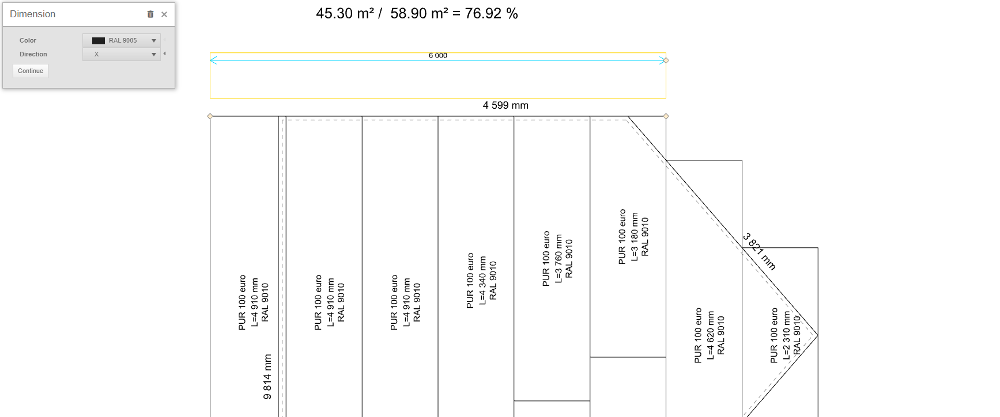

# Tilling drawing of the roof plane
The Tilling roof plane drawing is a key part of the building design process, allowing the design plans to be translated into practical design on the roof. This drawing serves as a detailed guide for builders when installing a roof system and contains important information on material placement, connections and all technical aspects that are essential for a quality and safe roof construction.

In HiStruct, complete drawings for all roof planes are automatically generated based on the 3D model. To edit these drawings, simply press the *Drawing* button.

## Add dimension

The dimension can be entered by clicking the *Dimension* button, selecting two points for which we want to determine the dimension, and then specifying the distance of the leading line. After clicking on the dimension, it is possible not only to change its color but also to determine the direction in which the dimension will be measured. The direction can be set to *X*, *Y*, or *Default*, which measures the shortest distance between these points. Alternatively, you can choose the *Angle* direction, which measures the dimension at the chosen angle. The last option in adjusting the dimension is the Continue button, which generates another dimension in the same direction.

If it is required to edit any point of the dimension, it is possible by clicking on the dimension and by moving the yellow points.

## Adding a line

Another element that can be added to the drawing is [polyline](..\instructor-roofs\insertPolyline.md). For this line, only the color can be modified.

