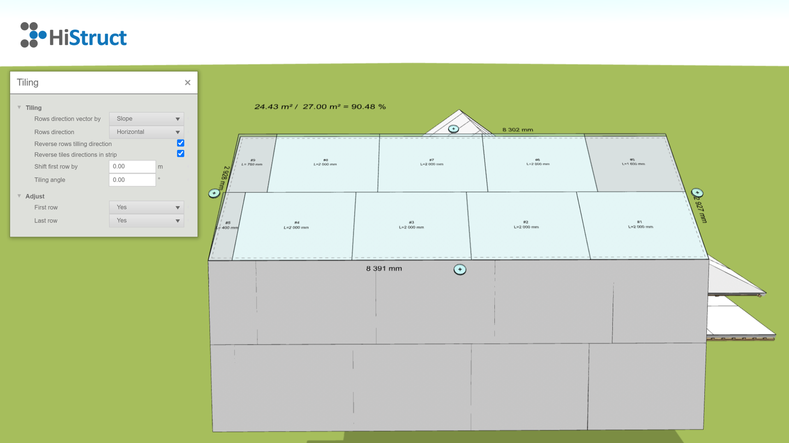

# 🛠️ Easy to work with the Roof Plate Generator

Welcome to our roof panel generator! 🎉 This tool will help you easily lay out the roof panels on your project. No complicated setup beforehand - everything happens right on the screen, where you can customize each section of the roof to your liking.

First, the generator automatically lays out the boards to cover the entire roof. Now comes the fun part! 💡 You can start customizing each roof plane separately. For each roof plane, you have several parameters to help you fine-tune the details to your liking.

Let's see how it works 👇:

1. **Enter the generator:** Once the roof is generated, you can start editing each plane. Click on the plane you want to edit and the editing options will open.
   

2. **Setting parameters - laying:** Each roof plane has its own parameters that allow you to fine-tune the laying of the boards, optimise material usage and ensure a perfect result.
   

    - **Controlling the laying direction:** This parameter determines the direction of laying the tiles, either according to the slope direction or one of the edges of the roof plane. Use the arrows to select which edge to start laying on; this edge is highlighted in the model with a dashed line.
    - **Laying direction:** Determines whether the strips are laid horizontally or vertically with respect to the laying direction. ↔️
    - **Reverse the laying direction:** Checking this parameter reverses the laying direction.
    - **Reverse the laying direction of the fittings:** This parameter allows you to reverse the laying direction of the fittings in each lane.
    - **Shift first row:** Specifies the location of the first horizontal joint from the origin. The main use of this parameter is when the first row is moved off, which you will learn when you proceed further.
    - ** Laying angle:** The size of the angle determines the deviation of the laying from the specified edge.

3. **Parameter Settings - Edit:** This section is used to turn off the first or last row if needed. This can be useful if the last row is, for example, only a 5 cm wide strip that will be added from another roof plane.
It is easy to use: in the menu for each stripe you have 3 options: *Yes, No* and *Any*. For example, if you have 30 cm left over from another roof plane, you can set the first row to be offset by 30 cm, set the first row to *General* and write in the *Description* field "Strip from roof plane K will be used". This description will then be reflected in the model, drawing and BOM. 📝

4. **Setting Offset:** If you want to set an edge offset or extend the covering over an edge, it's easy. Click the ➕ button next to the selected edge and set a value to increase or decrease the area by the given offset.

And that's it! Now the board placement is set! 🎉
