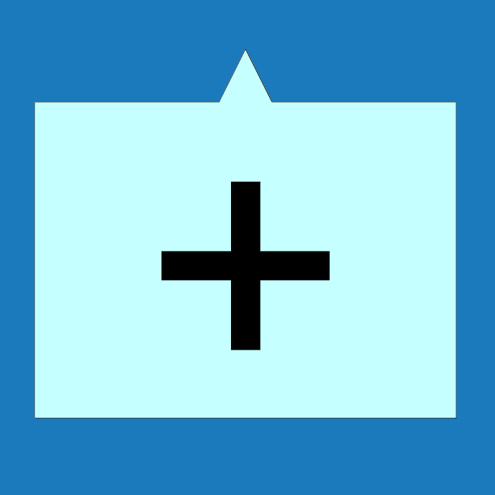

# Lemovky
Umožňuje měnit jednotlivé lemovací prvky včetně typu materiálu nebo barvy.

Tyto vlastnosti lze upravit pomocí tlačítek vlevo pro všechny lemovací prvky z dané skupiny. 

Vlastnosti jednotlivých prvků je možné měnit přímo kliknutím na jednotlivé prvky v modelu. Pro jednotlivé prvky je možné měnit i typ hrany.

<b><u>Počet skupin editovatelných lemovacích prvků se může měnit podle možností jednotlivých modelů.</u></b>

#

## Editace skupin prvků pomocí tlačítek vlevo
Kliknutím na tlačítko lemovacího prvku na levé straně je možné editovat vlastnosti celé příslušné skupiny lemovacích prvků. 

<table>
  <tr>
    <td>
      

        
      

      Štít
      

      

    </td>
    <td>
      

        
      

      Okap
      

      

    </td>
    <td>
      

        
      

      Okapnice
      

      

    </td>
    <td>
      

        
      

      Hřeben
      

      

    </td>
    <td style="vertical-align: middle; font-size: 20px;">
      ... a další
    </td>
  </tr>
</table>

Provedené změny vlastností se propíší na všechny prvky spadající do určené skupiny.
#
## Editace jednotlivých prvků
Vlastnosti jednotlivých prvků je možné měnit přímo kliknutím na jednotlivé prvky v modelu. 

Pro jednotlivé prvky je možné měnit i typ hrany nebo prvky prodloužit o příslušnou délku.

<!-- Tlačítko pro otevření modálního videa -->
<button onclick="document.getElementById('modal').style.display='flex';" class="btn">
  Přehrát videoukázku
</button>

<!-- Modální okno (skryté) -->

  <video id="modalVideo" controls autoplay style="max-width: 90%; max-height: 80vh;">
    <source src="img/VideoEditFlashing.mp4" type="video/mp4">
    Váš prohlížeč nepodporuje přehrávání videa.
  </video>
   
  <button onclick="
    document.getElementById('modal').style.display='none';
    const vid = document.getElementById('modalVideo');
    vid.pause();
    vid.currentTime = 0;
  " class="btn">
    Zavřít video
  </button>

<!-- Skript -->

#
<table>
  <tr>
    <td>
      

        
      

      Měření
      

      

    </td>
    <td style="vertical-align: middle; font-size: 20px;">
      Měření
    </td>
  </tr>
</table>
Tlačítkem <u>Měření</u> je možné zkontrolovat rozměry modelu.

#
<table>
  <tr>
    <td>
      
    </td>
    <td style="vertical-align: middle; font-size: 20px;">
      Přidat
    </td>
  </tr> 
</table>

Tlačítko <u>Přidat</u> umožňuje přidat k příslušnému okapovému žlabu další okapový svod.

#

### Nepomohla Vám nápověda?
Pro více informací o funkcích HiStruct Building Configurator můžete navštívit náš blog nebo zaslat dotaz na naší podporu. 
<table>
  <tr>
    <td>
      <a href="https://docs.histruct.com/cs/"> 
        <button class="btn">
        Navštívit blog
        </button>
      </a>
    </td>
    <td>
      <a href="mailto:support@histruct.com?subject=Dotaz na Support HiStruct">
         <button class="btn">
         Zaslat dotaz
         </button>
      </a>
    </td>
  </tr>
</table>