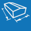

# Hlavní menu
V <u><i>Hlavním menu</i></u> naleznete přehled hlavních modelovacích funkcí platformy HiStruct.
#

<table>
  <tr>
    <td>
      

        
      

      Geometrie
      

      

    </td>
    <td style="vertical-align: middle; font-size: 20px;">
      Geometrie
    </td>
  </tr>
</table>

Tlačítko <u>Geometrie</u> umožňuje měnit geometrické parametry modelu, tedy rozměry budovy a střechy včetně sklonu a přesahů. Rovněž je zde možné nastavit typ skladby střechy. 

#
<table>
  <tr>
    <td>
      

        
      

      Opláštění
      

      

    </td>
    <td style="vertical-align: middle; font-size: 20px;">
      Opláštění
    </td>
  </tr>
</table>

Tlačítko <u>Opláštění</u> umožňuje měnit typ skladby opláštění pro celý objekt i pro jednotlivé střešní či stěnové roviny. 

V menu <u>Opláštění</u> je v ZÁKLADNÍM módu možné nastavit typ skladby střechy, upravit typ krytiny a rozměry sekundární střešní konstrukce. Pro stěnové konstrukce je možné nastavit typ skladby opláštění a upravit pro jednotlivé vstrvy upravit typ materiálu.

V ROŽŠÍŘENÉM módu je možné provádět pokročilou editaci - dle typu opláštění střechy a stěn je možné upravit typ krytiny a sekundární konstrukci včetně směru kladení a také vygenerovat výkazy materiálů i editovatelné výkresy jednotlivých vrstev střešní či stěnové konstrukce. 

#
<table>
  <tr>
    <td>
      

        
      

      Lemovky
      

      

    </td>
    <td style="vertical-align: middle; font-size: 20px;">
      Lemovky
    </td>
  </tr>
</table>

Tlačítko <u>Lemovky</u> umožňuje přidávání a úpravu jednotlivých lemovacích prvků a nastavení okapového systému.

#
<table>
  <tr>
    <td>
      

        
      

      Otvory
      

      

    </td>
    <td style="vertical-align: middle; font-size: 20px;">
      Otvory
    </td>
  </tr>
</table>

Přes tlačítko <u>Otvory</u> je možné do konstrukce přidávat otvory pro okna a komíny či jiné překážky.

#
<table>
  <tr>
    <td>
      

        
      

      Výkresy
      

      

    </td>
    <td style="vertical-align: middle; font-size: 20px;">
      Výkresy
    </td>
  </tr>
</table>

Přes tlačítko <u>Výkresy</u> je možné vygenerovat a upravit výkresy střešní či stěnové konstrukce, například půdorys nebo boční pohledy. Výkresy lze v nově otevřeném okně dodatečně upravit a doplnit libovolnými popisky či kótami.

#
<table>
  <tr>
    <td>
      

        
      

      Výkazy
      

      

    </td>
    <td style="vertical-align: middle; font-size: 20px;">
      Výkazy
    </td>
  </tr>
</table>

Tlačítkem <u>Výkazy</u> je možné vygenerovat pohledy na vymodelovanou konstrukci, výkazy materiálů pro poptávku a editovatelný dokument pro celkové shrnutí nabídky s možností nastavení cen pro jednotlivé prvky.  

#
<table>
  <tr>
    <td>
      

        
      

      Nastavení
      

      

    </td>
    <td style="vertical-align: middle; font-size: 20px;">
      Nastavení
    </td>
  </tr>
</table>

V <u>Nastavení</u> lze upravit možnosti modelování a vzhled modelovací scény.
#

### Chybí vám v galerii některá krytina? Napište nám, doplníme ji.
<table>
  <tr>
    <td>
      <a href="mailto:jiri.podval@histruct.com?subject=Dotaz na HiStruct konfigurátor budov">
        <button class="btn">
        Chci doplnit
        </button>
      </a>
    </td>
  </tr>
</table>

### Nepomohla Vám nápověda?
Pro více informací o funkcích HiStruct Building Configurator můžete navštívit náš blog nebo zaslat dotaz na naší podporu. 
<table>
  <tr>
    <td>
      <a href="https://docs.histruct.com/cs/"> 
        <button class="btn">
        Navštívit blog
        </button>
      </a>
    </td>
    <td>
      <a href="mailto:support@histruct.com?subject=Dotaz na Support HiStruct">
         <button class="btn">
         Zaslat dotaz
         </button>
      </a>
    </td>
  </tr>
</table>