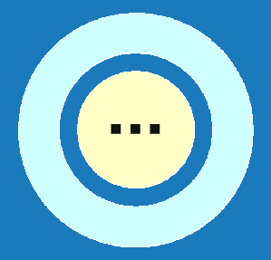
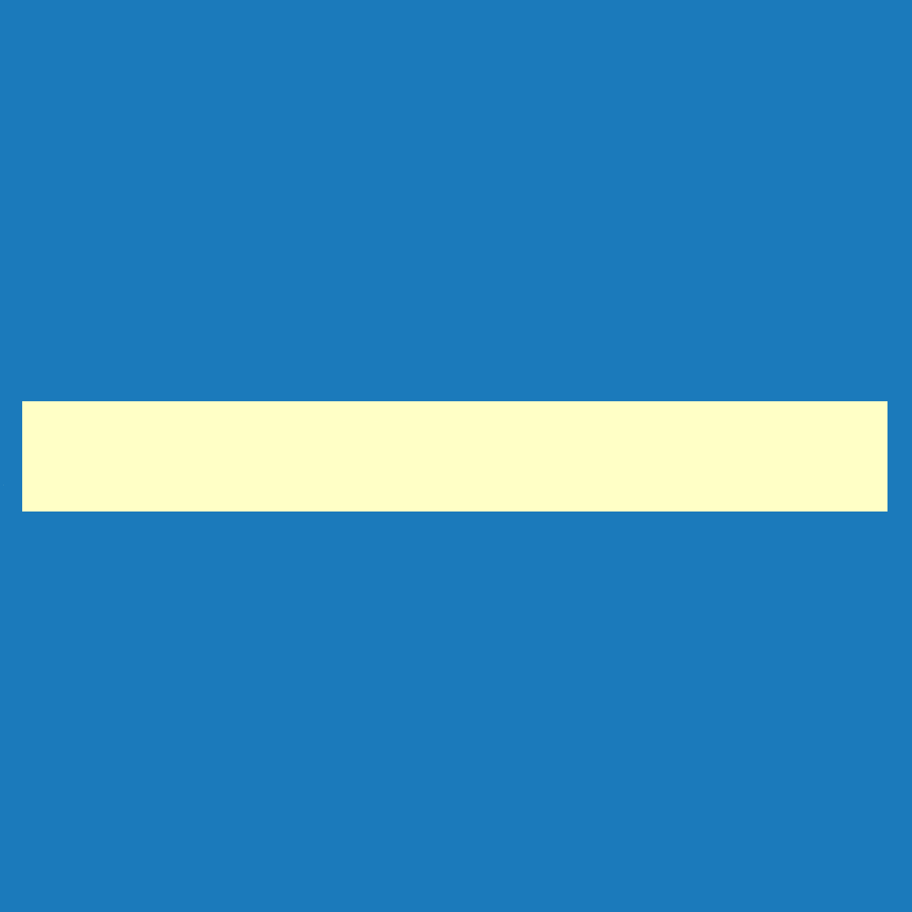

# Opláštění > Sekundární struktura stěny

V menu <u><i>Opláštění > Sekundární struktura stěny</i></u> přístupném přes <u>Editační tlačítko</u> je možné generovat editovatelné výkresy sekundární stěnové konstrukce.

<b><u>Ovládací a Editační tlačítka</u> upravují vlastnosti konstrukce pouze na vybrané stěnové rovině.</b>

#
<table>
  <tr>
    <td>
      

        
      

      Rámy
      

      

    </td>
    <td style="vertical-align: middle; font-size: 20px;">
      Rámy
    </td>
  </tr>
</table>

* ...Funkcionalita tlačítka <u>Rámy</u> se připravuje pro budoucí verze programu...

#
<table>
  <tr>
    <td>
      

        
      

      Kusovník
      

      

    </td>
    <td style="vertical-align: middle; font-size: 20px;">
      Kusovník
    </td>
  </tr>
</table>

* ...Funkcionalita tlačítka <u>Kusovník</u> se připravuje pro budoucí verze programu...

#
<table>
  <tr>
    <td>
      

        
      

      Výkres
      

      

    </td>
    <td style="vertical-align: middle; font-size: 20px;">
      Výkres
    </td>
  </tr>
</table>

Generuje výkres určené stěnové roviny s použitou sekundární stěnovou konstrukcí. Výkres je možné dále editovat, doplnit popisky a kótami.

#
<table>
  <tr>
    <td>
      

        
      

      Měření
      

      

    </td>
    <td style="vertical-align: middle; font-size: 20px;">
      Měření
    </td>
  </tr>
</table>

Tlačítkem <u>Měření</u> je možné zkontrolovat rozměry modelu.

#
<table>
  <tr>
    <td></td>
    <td style="vertical-align: middle; font-size: 20px;">Ovládácí tlačítko</td>
  </tr> 
  </table>

Pro jednotlivé stěnové roviny umožňuje:
* Nastavit typ výroby stěny, kladení řad opláštění a výšku soklu, dále barevné schéma a typ materiálů jednotlivých vrstev opláštní včetně rozměrů prvků sekundární konstrukce. 

* Taktéž umožňuje vytvářet výkazy materiálů a generovat pohled na stěnu ve fromě editovatelného výkresu.

#
<table>
  <tr>
    <td></td>
    <td style="vertical-align: middle; font-size: 20px;">Editační tlačítko</td>
  </tr> 
  </table>

Pro jednotlivé vrstvy skladby stěny na určené stěnové rovině umožňuje:

- Nastavení směru kladení, taktéž úpravu pozice a úhlu kladení opláštění.

- Úpravu barevného schématu opláštění.

- Generování výkresu příslušné vrstvy stěnové konstrukce ve formě editovatelného výkresu.

- Pro vrstvu vnějšího opláštění je možné také vygenerovat výkaz materiálu s položkami.

#

### Chybí vám v galerii některá krytina? Napište nám, doplníme ji.
<table>
  <tr>
    <td>
      <a href="mailto:jiri.podval@histruct.com?subject=Dotaz na HiStruct konfigurátor budov">
        <button class="btn">
        Chci doplnit
        </button>
      </a>
    </td>
  </tr>
</table>

### Nepomohla Vám nápověda?
Pro více informací o funkcích HiStruct Building Configurator můžete navštívit náš blog nebo zaslat dotaz na naší podporu. 
<table>
  <tr>
    <td>
      <a href="https://docs.histruct.com/cs/"> 
        <button class="btn">
        Navštívit blog
        </button>
      </a>
    </td>
    <td>
      <a href="mailto:support@histruct.com?subject=Dotaz na Support HiStruct">
         <button class="btn">
         Zaslat dotaz
         </button>
      </a>
    </td>
  </tr>
</table>