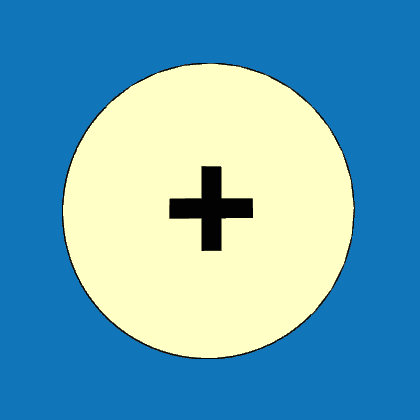

# Geometry &gt; Dimensions &gt; Area

The <u><i>Geometry &gt; Dimensions &gt; Area</i></u> menu, accessible by clicking on the selected surface, allows you to edit roof planes via an open table.

For each roof surface, you can edit the type of geometric projection of the surface, the dimensions for certain surface shapes, as well as the slope, slope direction, and the eaves height above the plan projection of the plane.

Using buttons at the top of the table, a surface can be copied, deleted, rotated in the plan view or in the plane of the surface, and also moved in all 3 directions.

{{ box_icon("img/LoopEditIcon64x64.png", "Geometry", "Geometry") }}

The <u>Geometry</u> button allows further geometry adjustments for the respective roof plane.

<b>
Edits can be made by clicking on the edge of the respective surface; for planes drawn using the General Shape, some of the yellow buttons shown on the edges can also be used.
</b>

<b><u>Planes drawn using predefined shapes</u></b>

<ul>
<li>

For planes drawn with predefined shapes (Rectangle, Triangle, Trapezoid, ...), you can change the type of geometric shape and its dimensions, or rotate the surface around the Z plane as needed.

</li>
</ul>

<b><u>Planes drawn using the General Shape</u></b>

<ul>
<li>

For planes drawn using the General Shape, you can change the type of geometric shape after clicking on the edge of the surface (and then adjust dimensions), or rotate the surface around the Z plane as needed.

</li>
<li>

By clicking on one of the corner points (displayed as a red cross), you can adjust this point’s position in Global coordinates in the respective table.
These points can also be added to the edge using the yellow Add button 
.

</ul>

{{ box_icon("img/ActionsIcon64x64.png", "Actions", "Actions") }}

Using the <u>Actions</u> button, you can adjust the position and orientation of the roof plane.

Planes can be rotated about the main X, Y, and Z axes, their position can be adjusted, or they can be flipped.

