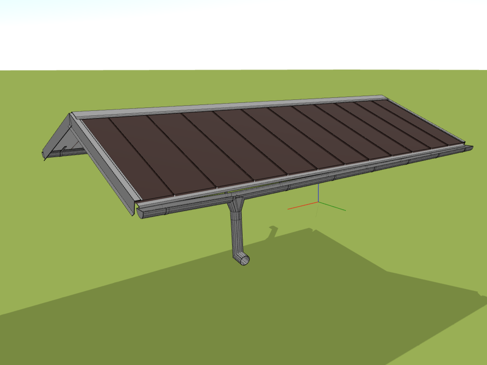

# Adding eaves or trims

With the *Gutter* button, adding a gutter system or flashing to your roof is simple and efficient. The method of addition varies depending on the type you choose, but the easiest way is to use our automatic generator. This intelligent tool recognises the individual edges of the roof plane and assigns the corresponding trims itself. The generated edging and the eaves system can then be freely modified, changed or removed as required.

[❔Help for using the generator](../getting-started-roofs/roofFlashingGenerator.md)

[❔Help for adding a gutter system](../getting-started-roofs/roofFlashingGutterOptions.md)

[❔Help for adding flashings and trims](../getting-started-roofs/roofFlashingOptions.md)