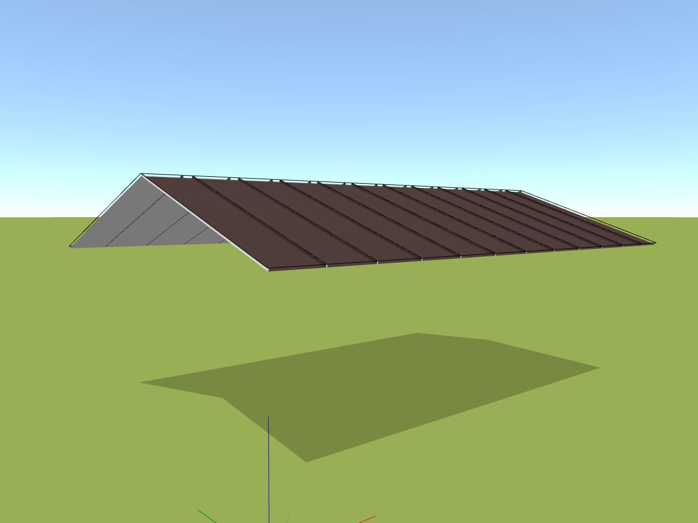

# Adding a roof plane

With the *Surfaces* button, adding a roof plane is a breeze. You can choose from the predefined shapes in our menu, or opt for a custom, unique shape using a generic shape.

[❔Help for adding a roof plane](../getting-started-roofs/modellingRoofs.md)
