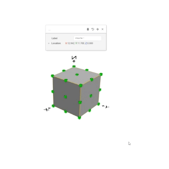

# Basic functions

For each 3D model object in HiStruct, you can use the basic functions for that object. The most basic and common tools are: pan, rotate and delete the object.

## Moving an object

To move an object, click on the move icon. Then select the reference point to move and then select the next point to move the object.

## Rotate the object

After clicking the rotate icon, select a reference point on the surface around which the object will rotate. This is done using the protractor associated with the cursor. Then select a second point and use the third point, or by typing the rotation angle, to rotate the object.

## Deleting an object

Another basic function is to delete an object, which you do by clicking on the trash can icon.

## Close dialog box

The last symbol, the cross, is used to close the dialog box. This window can be called up again by clicking on the object.

