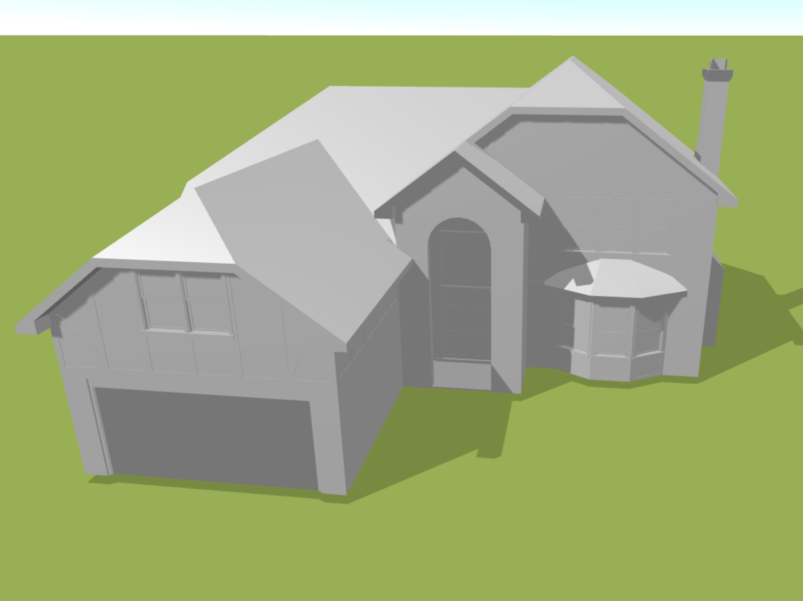

# Import

The *Import* button is used to easily import various documents to make it easier to model the desired project. You can insert files in DXF or OBJ format. In addition, you have the option to convert your documents from PDF to one of the supported file types, opening up new possibilities and making your modelling work easier.

[❔Help for importing DXF files](../getting-started-roofs/importDxf.md)

[❔Help for importing OBJ files](../getting-started-roofs/importObj.md)

[❔Help to convert PDF to DXF](../getting-started-roofs/convertPdfToDxf.md)

[❔Help to convert 3D PDF to OBJ](../getting-started-roofs/convert3dPdfToObj.md)

