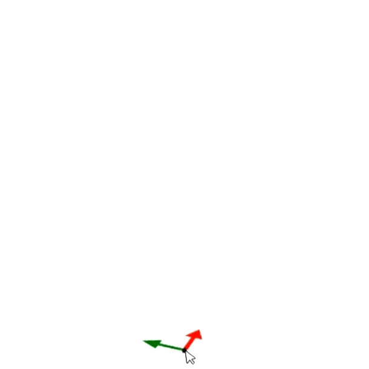

# Specifying an object using a point

After selecting the object you want to insert, the symbol for the origin of the coordinate system appears on the screen. Then, if you click with the mouse on the location where you want to place the selected object, the object will be inserted at the selected position.

