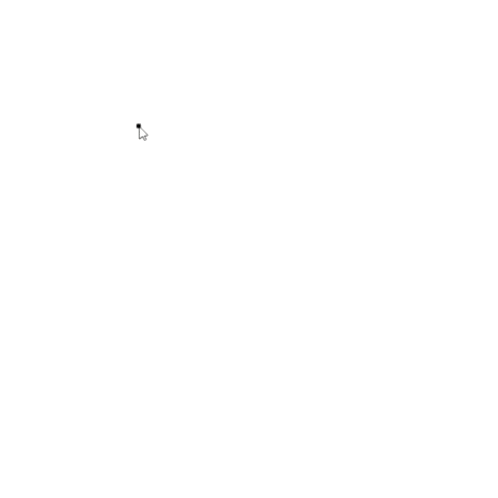

# Specifying an object using a polygon

If you want to add an object by typing a polygon, you will see a black dot next to the cursor. This dot is used to specify the first point of the polygon. You can then use the cursor to specify the other points of this polygon, and click on the first or last point to end the entry; this point is highlighted by a red dot at the cursor.

