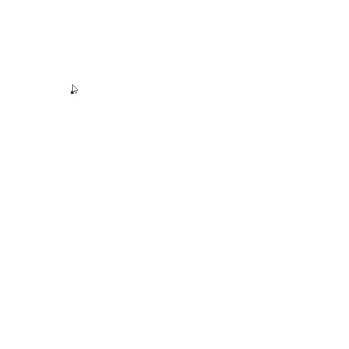

# Entering the roof rectangle

After selecting the object you want to insert, a black dot will appear on the screen next to the cursor. Click in the modeling space to select the first point of the rectangle to be inserted. Then drag the mouse and click into the second point to create the rectangle.  

