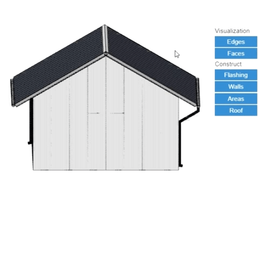

# Controlling levels in the model

In the modeling space, you can turn on and off individual levels of the 3D model. The model is divided into individual objects that have their own levels. By clicking on the button with the level name on the right side of the screen, the individual levels can be switched off and on again. Similarly, it is possible to globally turn on or off any edges or surfaces in the modeling space using the buttons at the top of this section.

