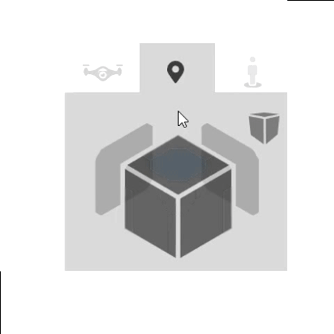
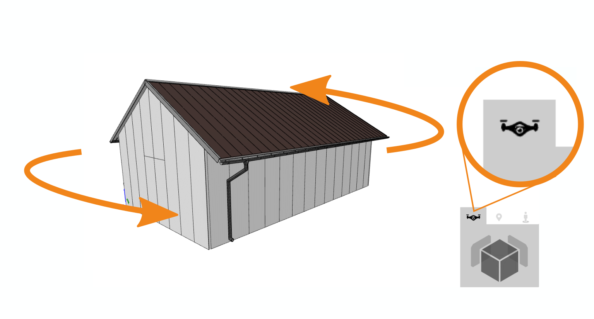
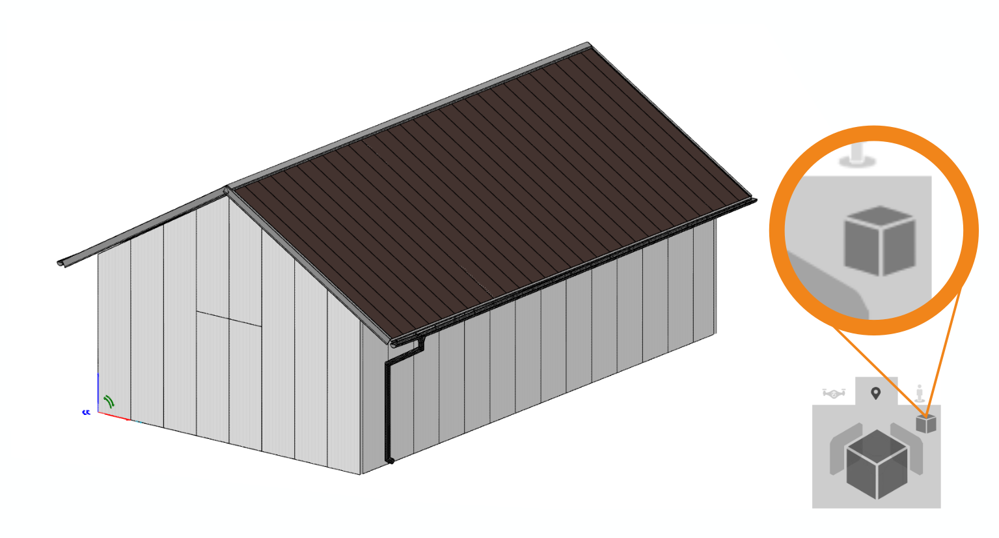
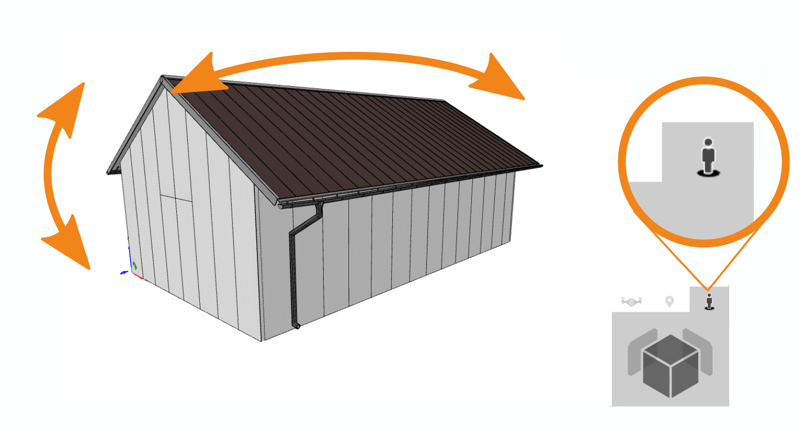

# Main

## Left menu
### Insert

This button is used to add an object to the modeling space. You can add various elements here, such as general shapes, roofs, walls or even entire houses. When clicked, groups of objects are displayed from which you can select for your work.

### Tools

Below this button you will find the tools for checking your model. You can use them to measure different dimensions of your project and also to work with the work plane.

### Drawings

This button allows you to manage and edit the generated drawings of the spatial model.

### Reports

To manage the outputs from your model, use this button. Not only can you view all the outputs here, but most of them can also be edited.

### Libraries

This button is used to edit all the libraries that are needed for 3D modeling. You can use it to add colors, change the roofing, or perhaps add textures to individual materials.

## Camera control
With this smart cube you can conveniently switch between different views of the model. Simply switch the axonometric view on and off or change the way the camera rotates.

### Camera control modes
HiStruct offers 3 camera control modes, which are designed for different applications. Controlling the scene with the left and right mouse button can look different depending on which mode is active.

#### Drone Perspective
When viewing the scene "from the drone", we rotate both mouse buttons (or tap and slide a finger on the touch screen) through the model, which remains in the center of the screen. The entire scene is therefore visible at all times, and zooming is always from or to the center of the scene.

Also handy in this mode is the use of the "A" key, pressing which turns on/off the automatic and constant rotation of the model around the center.

#### Point focus
This advanced mode is especially useful for experienced users who want to be able to focus and take a closer look at a specific point on the model. This is because the rotation of the left mouse button takes place around the point that determines the current position of the mouse cursor. Similarly, zooming is done towards or away from the point where the cursor is currently positioned. In this way, it is possible to bring the camera closer to the scene detail being examined and, by rotating, to explore it from all angles. The disadvantage of point focusing is that the entire model can "drift" out of the scene.

_TIP_: When using this mode, it is possible to switch from perspective view to axonometric view. While this is not natural and visually appealing to the human eye, it can be especially helpful when modeling or aligning lines, as it does not distort distances.

#### Human aerial view
In this mode, the camera moves to the eye level of the person and rotating the model with the left button follows the rotation of the head of the standing figure. Using the right mouse button simulates the movement of the person around the model.

_TIP_: Turning this mode on right after selecting the top view puts the camera inside the model and we can look around as if we were standing in the middle of a building.

The last mode used is saved in the browser's memory and you will have it active every time you open HiStruct again.

## Controlling levels in the model

You can turn on and off individual levels of the 3D model in the modeling space. The model is divided into individual objects that have their own levels. By clicking on the button with the level name on the right side of the screen, the individual levels can be switched off and on again. Similarly, it is possible to globally turn on or off any edges or surfaces in the modeling space using the buttons at the top of this section.

