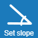
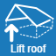

### Top view
Here you can enter the roof contour or modify the rear contour.

####  Roof boundary
If you have not yet created a roof boundary, you can input a boundary by clicking the roof boundary button. The button is unavailable if the roof boundary is already entered.

####  Set slope
The slope of the roof surfaces can be adjusted in degrees for the entire roof. If you need to set the slope separately on a roof area, click on a boundary edge in the model and set the slope there.

####  Lift roof
The specified roof can be lifted by a value valid for the whole geometry.

####  Delete all
Deletes the entire roof boundary entry and subsequent changes in following input steps.

####  Next 
Using Next button, continue to following input step.

