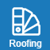

# Roofing
Here you can choose the roofing material for the configured roof.

##  Back
Using Back button, return to previous input step.

##  Roofing
Set the roofing material to cover your roof.

##  Roof plane
If you need to detail the tilling layout or view the drawing and bill of materials, select the roof area button or click on the selected roof area in the model.

##  Next 
Using Next button, continue to following input step.

Are you missing different flashing types? Let us know, we will add them.
