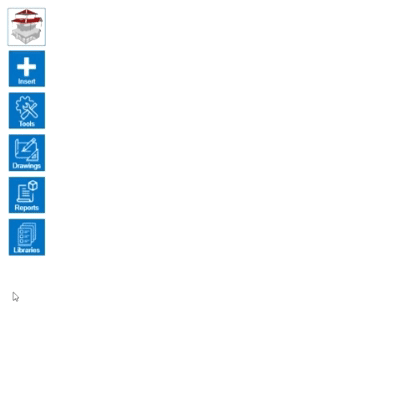

# Material library control

Controlling the materials library in HiStruct is intuitive and easy. To add a roofing material, simply press the *Add* button in the menu, and the new roofing material will instantly appear. Here you have the option to change the *Type* of the roofing material, which opens up a wide range of parameters for further customisation. In this menu you will find a wealth of customisation options that can be easily and intuitively changed to suit your needs.

