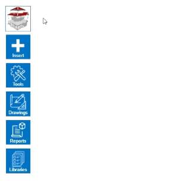

# Surface library control

Controlling our rich library of surfaces is a breeze. Just click on the selected library and a list of all available elements will appear. Adding a new element is easy - press the *Add* button.

To edit existing elements, click on them in the library and edit them via the intuitive dialog box. Change not only surface colours from our extensive RAL colour palette, but also add textures or any colour.

Create models with an individual look thanks to our surface library.

